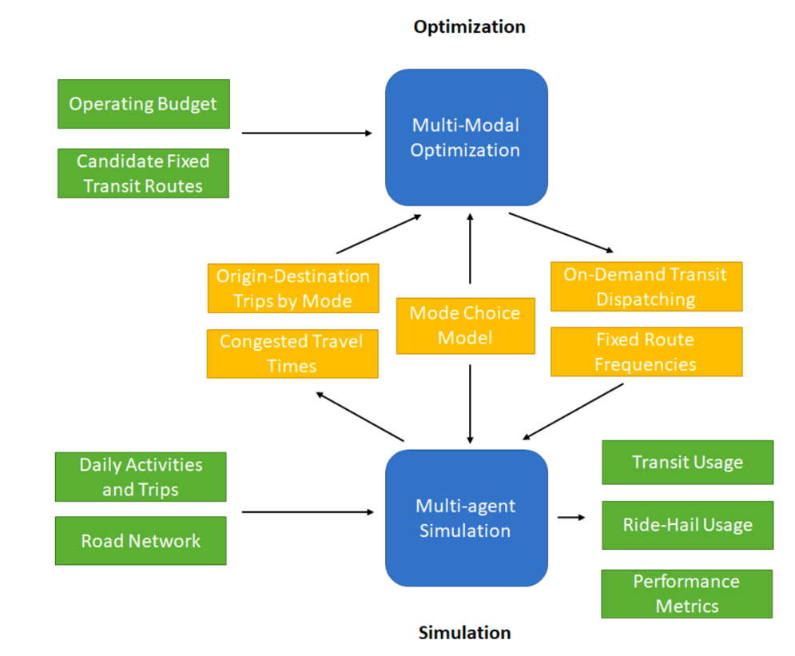

```{r, include = FALSE}
# Outline
#Here is my outline for the entire thesis. Hopefully this will give me a rough idea of what to write about.

#  1. Introduction *(5pg)*
#    a. First/Last mile transit
#  2. Literature Review *(20-30pg)*
#    a. Discus Mode Choice (4-step model, ABMs, microsimulations)
#    b. Discuss ActivitySim (modechoice)
#    c. Discuss MATSim (modechoice)
#    d. Discuss BEAM (modechoice)
#    e. Figure explaining tour type and first trip difference?
#    f. Variables showing path,person,location?
#  3. Methods
#    a. What did we add to BEAM?
#    b. Algorithms
#    c. How did we make scenario?
#    d. What scenarios did we run? SLC + SL / Data & Calibration
#    e. What tests did we run? (path, person, location effects)
#  4. Results
#    a. Describe tests and findings
#  5. Discussion
#    a. What does it mean?
#    b. Limitations --> Future research recommendation
#  6. Conclusions
#    a. Wider implications
#    b. First mile last mile
#    c. climate change lol
```

# Introduction 

In the intro talk about the tscore setup, along with the desire to understand on-demand transit vehicles. Talk about how a consistent mc will help better model these on demand transit vehicles.

## Problem Statement
In 2020, a project from the Transit - Serving Communities Optimally, Responsively, and Efficiently (T-SCORE) Center was proposed with the goal of keeping transit sustainable and resilient into the future. This project included multiple tracts involving both community analysis and multi-modal optimization and simulation (MMOS) analysis. The goal of the MMOS tract was to be able to quantitatively evaluate some big picture transit visions. By creating a multi-modal optimization and simulation model that can operate at the planning level, new transit strategies could be analyzed. One particular new transit strategy the MMOS analyzed was the introduction of new microtransit services. Furthermore, the MMOS had a goal of understanding if introducing on-demand transit vehicle services could help minimize the first-mile/last-mile transit problem.

Figure \@ref(fig:mmos) displays the entire overview of the MMOS part of the project. It displays the necessary steps that were taken to analyze the introduction of on demand transit vehicles. The inputs are represented in green whereas the outputs are represented in yellow (with the exception of the mode choice model). An integral part to the MMOS was the mode choice model. Depicted in Figure \@ref(fig:mmos) it seems like a singular mode choice was build, and then inserted into the multi-agent simulation and the multi-modal optimization. However, in reality this was not the case. Instead a separate mode choice model was used in the multi-agent simulation as well as a separate model in the multi-modal optimization. In addition, an activity-based model was used to create the daily activities and trips that were fed into the multi-agent simulation. This activity-based model also had its own mode choice model. The areas highlighted in blue in Figure \@ref(fig:mmos) displays the software that used its own mode choice model.

```{r mmos, fig.cap='Overview of the T-SCORE MMOS tract process.', out.width='75%', fig.asp=1, fig.align='center', echo=FALSE}

```

Creating consistency between the mode choice models for all the moving parts of the MMOS tract was crucial to creating a reliable product. Specifically, a consistent mode choice model would minimize error in predicting the effectiveness of inserting on-demand transit vehicles into a particular region. For example, an inconsistency between one mode choice model over another could result in an inaccurate prediction of needing 100 vehicles in an area. In reality though, that area truly only needs 25 on-demand transit vehicles. Therefore, in an effort to minimize error in predicting on-demand transit vehicle use, a consistent mode choice model was desired. With that consistent mode choice model, answering the question on whether or not on-demand transit vehicles can help solve the first-mile/last-mile transit problem becomes possible.

## Purpose of Research
This research, as inspired by the mode choice model within the MMOS tract of the T-SCORE project, includes one primary objective. That objective is to understand the effects of a consistent mode choice model between an activity-based model and a microsimulation tool. Along with understanding the effects of a consistent mode choice model, this research also aims to understand the effects of different types of mode choice utility parameters. Specifically the effects of predicting mode choice between path, person, and location type variables are explored. In addition, the effects of a consistent mode choice on subtour trip mode choice selection are analyzed. Overall, if consistent mode choice models better predict mode choice, we can make better predictions on how to implement new transportation strategies. Particularly, we can better understand how to implement on-demand transit vehicles in certain areas as to help solve the first-mile/last-mile transit problem. 

Two important software were used to carry out the research objective. ActivitySim, an open-source advanced activity-based travel model, was used to create daily activity patterns (DAPs) for agents in the Salt Lake City, Utah region [@asim]. BEAM, an agent-based microsimulation tool, was used to model the DAPs of the agents [@beam]. BEAM has the capabilitiy to accomplish within-day planning where agents are able to dynamically respond to new transportation services. This project's main objective was carried out by changing BEAM's default mode choice model to more closely align with that of ActivitySim's. The details behind each software and their mode choice model will be discussed further on in the thesis.

## Outline of Research
Chapter 1 introduces the objectives and motives behind the research. This chapter also give the outline to the thesis. In Chapter 2 an extensive literature review on mode choice modeling is conducted. Chapter 2 begins by explaining mode choice in the four step model as well as giving a brief history of mode choice in discete choice modeling. Afterwards, the broad range of mode choice models used in activity-based models are explained. Then, the mode choice models of ActivitySim, MATSim, and BEAM are described in detail. Finally, the research gap is provided explaining the need for understanding the importance of mode choice consistency. 

Chapter 3 describes the methods that were taken in order to answer the research questions presented. First, how the test scenario was created is explained. This also involves understanding the set up of ActivitySim and BEAM for the Salt Lake City, Utah region. After explaining the setup process, the methods toward creating an improved mode choice model in BEAM is described. An explanation on data validation and calibration follows. 

Chapter 4 describes the results of having a consistent mode choice model within the BEAM model. Specifically, this chapter explains three tests used to verify the effects of mode choice consistency. The first test compares total modal distributions. The second test aims to show the effects of different types of mode choice utility parameters. Finally, the third test shows the differences in subtour mode choice between the BEAM and ActivitySim models. 

Chapter 5 has the purpose of reviewing the results and determining the effects of the research as a whole. It also describes the what the next steps moving forward are as well as the limitations in this research. A conclusion is then given in Chapter 6 where the wider implications are explained and the  first-mile/last-mile problem is restated.


