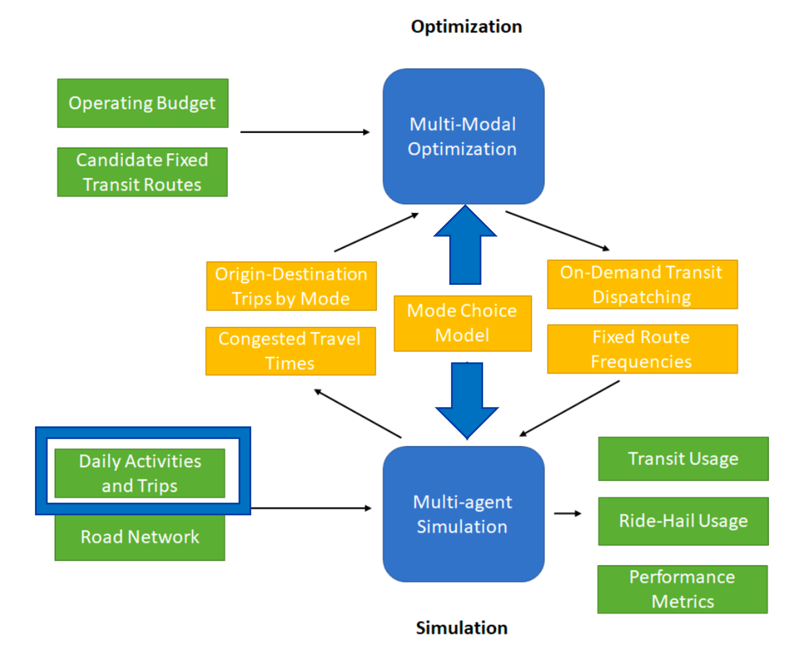

# Introduction {#intro}

## Problem Statement
On-demand transit modes, such as microtransit and ride-hailing, can make private car-centric societies more sustainable [@tirachini20]. They have the potential to exhaust less vehicular emissions, decrease roadway congestion, increase health, increase public transit usage in some cases, and be economically viable [@marquet20; @chen21]. As urban centers attempt to shift from a private car-centric environment to a multi-modal system, forecasters are challenged with modeling accurate ridership and level of service values. Since ride-haling is already heavily involved in today's transportation system, estimating the uptake of ride-hailing usage and understanding the service capabilities of ride-hailing is critical to a sustainable future.

Unfortunately, forecasting the ridership and level of service of ride-hailing and other novel modes is a challenging feat with no clear methodological approach. Individuals using ride-hailing vehicles behave differently than when using regular car modes and so understanding their behavior and the ride-hailing service capabilities is particularly challenging [@kang21; @li20; @dong20; @dean21]. In addition, the ridership of bike share, an affordable and sustainable bike rent program, has been modeled many times each with a different methodology [@hyland18; @biehl19; @cho22; @li18; @welch20; @zhou19; @song19]. Similarly, forecasters have struggled to find the best technique for estimating the ridership of e-scooters (public electric scooters) and in what locations they would be most effective [@zuniga22; @tuli21; @zhang21; @lee21; @leeb21; @hosseinzadeh21].

Many different modeling methodologies exist with the purpose of better understanding the behavior of individuals using ride-hailing vehicles and other novel modes. For example, some forecasters use activity-based models, which construct daily activity patterns to model individual travel behavior, to better understand the travel patterns of those who use novel modes [@xu19; @muhammad19; @macfarlane21]. Other forecasters use multi-agent simulation, which focuses on modeling the interactions between different agents, to understand the level of service of transport technologies [@shimizu13; @sanchez19; @horl19b]. Some use spatial analysis joint with geography data to better understand where individuals use novel modes, like pickup and drop off locations, to travel [@hyland18; @cho22; @hosseinzadeh21]. @zhou19 have even attempted to use machine learning techniques to determine the optimal mode choice between bike-sharing and taxi services. Among these, and the other strategies that exist, some professional disagreement exists as to which approach would best serve forecasters in their efforts to model the ridership and level of service of ride-hailing to create sustainable city centers. In particular, a lack of understanding exists whether the relative strengths of an activity-based model and multi-agent simulation could be paired together successfully to model the uptake of on-demand services.

## Scope within T-SCORE
In 2020, a project from the Transit - Serving Communities Optimally, Responsively, and Efficiently (T-SCORE) Center was proposed with the goal of keeping transit sustainable and resilient into the future. As a result T-SCORE was divided up into two tracks: the community analysis track and the multi-modal optimization and simulation (MMOS) analysis track. The MMOS analysis track had the purpose of using modeling techniques to determine the effectiveness of on-demand transit modes and their efficiency at bringing users to and from transit locations. The hypothesis was that instead of having ridership of public transit compete with ride-hailing, to instead pair together ride-hailing and transit services. Modeling ride-hailing vehicles was an effective avenue toward understanding their impact on transit ridership. Figure \@ref(fig:mmos) shows the entire modeling and optimization process used in the MMOS track to analyze ride-hailing vehicles. The inputs are represented in green whereas the outputs are represented in yellow (with the exception of the mode choice model). The ideas behind this research originated with an attempt to develop an optimal mode choice model structure to forecast ride-hailing service capabilities for the T-SCORE project.

```{r mmos, fig.cap='Overview of the T-SCORE MMOS tract process.', out.width='75%', fig.asp=1, fig.align='center', echo=FALSE}

```

## Purpose of Research 
We develop a series of experiments to understand the relative importance of a paired activity-based model and multi-agent simulation in forecasting the use of ride-hailing services. We do this by examining the ridership and level of service of ride-hailing predicted by different activity-based model and multi-agent simulation mode choice combinations. Specifically, we use the daily activity plans generated by ActivitySim as inputs to the multi-agent simulation BEAM to establish nine different combinations of methodolgical approach. For each methodological combination, we estimate ride-hailing ridership and level of service outputs for a Salt Lake City, Utah case study region. The purpose of this research is not, however, a test of model accuracy in estimating ride-hailing ridership and level of service but instead, a in-depth comparison between different modeling approaches. With this comparison we aim to understand the relative effect different paired mode choice combinations can have in forecasting ride-hailing services. 

Section \@ref(lit) presents a brief literature review on different methodological approaches used to forecast ride-hailing services. Our specific methodological approach is then explained in Section \@ref(meth) with our results explained thereafter in Section \@ref(results). A discussion on our results along with limitations and further research ideas are presented in Section \@ref(discussion). The paper also concludes with a summary of our findings in Section \@ref(discussion).

