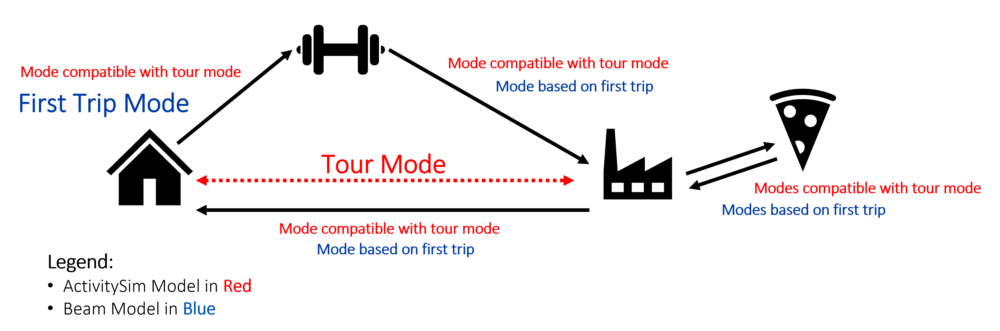

# Literature Review

## Overview
Mode choice models are essential components in the transportation planning process. Key investment decisions along with other transportation decisions rely on the determination of individual mode choices within a population. Whether mode choice is estimated in a four step model, activity-based model, or an agent based model, its level of significance remains the same. 

## Mode Choice in the Four Step Model {#lit1}
The four step model (FSM) has been the primary tool in person travel demand modeling since its development [@mcnally2000four]. Although travel is theorized to be derived from activity participation, the FSM focuses on modeling with trip-based not activity-based travel methods. The methodology presented in the FSM is mostly universal. The FSM can be divided up into two stages. The first defining the traveler and land use characteristics and the second where demand is loaded onto a transportation network and travel characteristics are determined [@mcnally2000four].

As its name suggests, the FSM includes four different steps: trip generation, trip distribution, mode choice, and route choice. In trip generation the magnitude of total trips is estimated and in trip distribution those trips are disbursed along different directions of travel. In mode and route choice, a multitude of variables are used to determine specifically how travel occurs. 

Of the four steps in the FSM, mode choice in particular is a diverse, variable, and disaggregate step among different modeling applications. According to @mcnally2000four, mode choice is almost exclusively modeled on a disaggregate level within separate choice-based sampling. Choice probabilities are calculated on the individual trip level. @mcnally2000four also mentions that with transit, carpooling vehicles, automobile tolls, and other new factors the mode choice algorithm can become extensive and difficult to determine. One common method used to estimate mode choice probabilities is a nested logit model (see Section \@ref(lit3)). These mode choice models can reflect trip-maker characteristics as well as multiple performance variables [@ortuzar94;@mcnally2000four]. Most applications of the FSM require multiple iterations of the mode choice and trip distribution steps in order to approximate formal convergence. Like with the nested logit model, discrete choice modeling has historically been the perferred method in estimating mode choice in the FSM as well as in other modeling applications.

## A Brief History of Mode Choice in Discrete Choice Models {#lit2}
Various choice modeling systems have been used to accurately determine mode choices. The beginning of such analyses started with the developments of @mcfadden1973, who outlined a general procedure for modeling population choice behavior from distributions of individual decision rules. Before then, discrete choices were simply modeled using a random utility model (RUM) framework. The interpretation assumed that each individual carried their own utility function distribution and selected one randomly; according to @manski2001, McFadden reinterpreted the random assignment of the utility functions across the population itself rather than the individual. This yielded an entirely new view of discrete choice modeling, and a more general version of the multinomial logit model (MNL) was introduced. This new MNL model, also called the conditional logit analysis, was the beginning of modern mode choice analysis. @bhat20 describe that McFadden’s MNL model, the nested logit model, and the multinomial probit model (MNP) were the main engines in mode choice and most discrete choice analyses up through the 1990s. 
	
Although the developments of McFadden are still in effect today, mode choice analysis has evolved greatly in the last few decades. @bhat20 explain that up through 2010, mixed multinomial logit (MMNL) models and multiple discrete-continuous (MDC) choice models were the main models in practice. In addition, @bhat95 estimated a disaggregate mode choice model to explain how new and updated services affected ridership and mode choice on intercity travel. His heteroscedastic extreme value model overcame the independence of irrelevant alternatives (IIA) property and allowed more flexibility among the alternatives than the nested logit model. @ben02 developed a hybrid choice model (HCM) that went beyond the standard RUM as it included latent variables, latent classes, and a flexible error structure. It implemented multiple facets of discrete choice modeling and more accurately represented the behaviors of the individuals. @pinjari07 used a simultaneous mixed logit model to understand how commuters' mode choice is affected by the surrounding build environment. 

According to @bhat20, from 2010 to 2015 joint models of data with mixed dependent variables arrived. @vij13, for example, used a behavioral mixtures model, composed of a latent class choice model (LCCM) and a continuous logit mixture model, to extrapolate unobserved modality styles and their effects on travel decisions. @paulssen14 focused on improving the integrated choice and latent variable (ICLV) model of @mcfadden86 and @ben02num2 by including a value system among the individuals. Overall, the general advancement within mode choice and discrete choice modeling is comprehensive across recent years. Similarly, the variability among mode choice analysis can specifically be seen within activity-based modeling. 


## An Extensive Look into Mode Choice in Activity-Based Models {#lit3}
A significant part of activity-based modeling is the mode choice decision within the model. @bhat99 stated that originally travel demand models used individual trips as the primary unit of analysis. In recent years though, there has been a shift toward activity-based travel demand modeling. According to @eluru10, this shift has occurred due to improved understanding of activity-based travel, global climate concerns, and advances in microsimulation techniques. With this shift to activity-based travel modeling, FSMs have evolved immensely, and especially within the last decade [@hasnine21]. A major maturing in activity scheduling, activity duration, activity generation, and location choice has occurred and resulted in advanced activity-based modeling. Although these components have evolved significantly, the mode choice decision has remained relatively simple and constant. 

In general, the two types of mode choice models commonly applied in travel demand modeling are trip-based and tour-based models. Trip-based mode choice models select modes based on the characteristics of individual trips, independent of other existing trips. A tour is defined as a chain of trips that end in the same location as they start [@bowman99]. Tour-based models are based on the characteristics of the trips' overarching tour, meaning trip modes are not independently calculated. Most activity-based models commonly implement the tour-based mode choice structure [@hasnine21].

The most common use of the tour-based mode choice model is the "simplified tour-based" mode choice model. The simplified tour-based model has been used in a variety of studies [@arentze00;@bowman01;@pendyala97]. This simplified model hinges on trip-based mode choice where a single mode is used to define the entire tour opposed to a string of possible mode option combinations. For example, a simplified tour-based mode choice would define the tour-mode as "public transit" whereas a true tour-based model would define the tour-mode as "public transit - ride hail - public transit". Simplified tour-based models overlooks mobility attributes as well as the dynamics that exist between trips on a tour [@hasnine21]. 

There have been many attempts during the last few decades to include trip and tour based mode choice models into activity-based models. As a way to better understand the diversity that exists with tour-based mode choice in activity-based models, @hasnine21 conducted research on a variety of activity-based models from the years 1995 to 2020 and found that seven specific mode choice analyses have been used. All seven techniques are framed about the tour-based methodology further reinforcing the knowledge that "the tour-based approach is the most relevant to the activity-based modelling framework" [@hasnine21].  These seven categories are further discussed in the following subsections.

### Simplified main tour model {#lit31}
The simplified main tour model is another name for the simplified tour-based model previously discussed and implemented in most activity-based modeling applications [@arentze00;@bowman01;@pendyala97]. In the A Learning-Based Transportation Oriented Simulation System (ALBATROSS) developed by @arentze00, for example, when individuals had a work activity in their daily plan, a transport mode was determined for the work travel purpose. A singular tour mode value was selected and given to that individual. In cases where households had less cars than people, a car tour mode assigned to one individual in a household may prevent a car mode being given to another individual in that same household. In this way, the simplified main tour model keeps track of car ownership and availability in a logical way. The ALBATROSS system selected the tour mode based on a subset of rules and decision trees programmed into the model. This means that the ALBATROSS system only allowed each trip within a tour to have the same mode as the tour mode [@arentze00].

Since a singular mode value is assigned to the tour in the simplified main tour model method, no flexibility exists for trip mode selection. Once a tour mode is determined, that same mode is held constant for each trip within that tour. Although not entirely realistic, many modelers prefer this method as it is a computationally easier task than a tour-based mode choice that permits trip modes to be different than their overarching tour mode. Realistically, however, individuals often vary their modes on different trips within a tour. For example, those who walk or bike or drive to transit are unable to do so in a simplified main tour model. Using the simplified main tour mode choice model may be popular and computationally simple, but it is not dynamic or realistic in representing travel behavior [@hasnine21].

### Two-tier nested logit model {#lit32}
The two-tier nested logit model first completes an upper-level location choice followed by a lower-level mode choice which corresponds to the destination's location. One example of this approach being implemented in the literature is the Florida Activity Mobility Simulator (FAMOS) model [@pendyala05]. The FAMOS model uses both the Household Attributes Generation System and the Prism-Constrained Activity-Travel Simulator in order to model activity patterns. The sub models within FAMOS include an activity-type choice, a joint destination and mode choice, and an activity duration choice. Additionally,  FAMOS mode choice model first determines the destination location, and then selects a mode dependent on the destination location. Although it uses a two-tier nested logit model, @hasnine21 states that a tour-based mode choice is not "explicitly identified" in the FAMOS model. At its development, FAMOS gave promising results in the effectiveness of an activity-based modeling system [@pendyala05]. It did not however include an extensive and powerful mode choice model.

### Simplified main tour mode and conditional trip-level mode {#lit33}
The simplified main tour mode and conditional trip-level mode choice model has two parts. First a tour mode is estimated. Then, conditional on the estimated tour mode and attributes of the activity, trip modes are estimated. One example of a model that uses this structure is called DaySim [@bowman06]. DaySim follows the same activity scheduling approach developed by @bowman01. The DaySim model is a microsimulation model that works off of four levels: long term person/household decisions, single day activity patterns, tour-level decisions, and trip-level decisions. The mode choice structure within DaySim involves a series of logsums and approximated logsums in order to econometrically estimate individual mode choice. More specifically, first a logsum is used to determine an overarching tour mode. This mode is used for all trip modes under that tour for the first steps within the model [@bowman06]. Later, however, trip modes are updated individually based on the tour mode value, origin and destination locations, and start times. The mode choice approach in DaySim is effective in that it relies heavily on fundamental econometric theories and allows trip modes to vary from tour modes [@hasnine21]. 

Other examples in the literature also use the simplified main tour mode and conditional trip-level mode choice structure, however only the details realting to ActivitySim's mode choice structure will be discussed further (see Section \@ref(lit4))

### An activity-based model with exogenous mode choice {#lit34}
The idea behind this mode choice model is that the mode choice decision is not estimated within the activity-based model, but estimated outside of it. One example of an activity-based model with the mode choice decision estimated exogenously is the comprehensive utility-based system of activity-travel scheduling options modelling (CUSTOM). The research done by @habib17 using the CUSTOM system assumed an exogenous mode choice. This meant that the mode specific travel time used to estimate travel behavior was an explanatory variable in the model. @habib17 mentions that the exogenous mode choice was a limitation in their research and further research is needed to specifiy how to seemlessly align the exogenous mode choice into the CUSTOM structure. @hasnine21 also mentions that a limitation to this mode choice model is that the mode is not modeled endogenously with other activity attributes.

### Simulation-based tour-based mode choice {#lit35}
The simulation-based tour-based mode choice model is a simulation-based approach to estimating modes when large sets of modal alternatives are present. An example of this approach in the literature is a model used by @miller05 called the Travel/Activity Scheduler for Household Agents (TASHA). TASHA is both agent-based and activity-based where decisions are modeled using a random utility framework. In addition, TASHA is both chain-based and trip-based meaning that individual trips have individual modes chosen, but tour modes are constructed in a chain-based manner. Utility functions are used to calculate the utility of both individual trip modes as well as chains of modes used in the tour-based mode choice model. TASHA adopts a probit modeling structure in order to determine probabilities of modal alternatives [@miller05; @hasnine21]. This simulation approach is computationally heaving but is effective in providing unique trip modes based on chain-based tour modes.

Another example of a simulation-based mode choice model is presented by @eluru10. @eluru10 developed a joint multiple discrete continuous extreme value (MDCEV) framework to model the individual’s choices across five dimensions: activity type, time of day, mode, destination, and time use. The MDCEV framework aimed to model activity travel choices simultaneously.

### Combinatorial tour-based mode choice {#lit36}
The combinatorial tour-based mode choice model simulates all combinations of modes within any given tour. A utility value is then calculated for the each combination of trip modes and a logit model is used to determine which combination any given agent will select. This method is computationally heavy, but allows the possibility for any combination of modes to exist [@hasnine21]. An example of this model being used in practice is the research conducted by @vovsha17.

### Dynamic tour-based mode choice {#lit37}
Dynamic tour-based mode choice models are programmed with dynamic discrete choice modeling. The central idea is to model sequential discrete choices in order to determine current and future outcomes. @saleem18 provides an example of implementing a dynamic tour-based mode choice model in the random utility based travel model named SCAPER. SCAPER makes decisions sequentially in time based on a random utility theory. MATSim also implements the SCAPER model by generating activity schedules, activity durations, activity locations, and mode choices. MATSim iteratively updates the mode choice based on the best modal option available, and continues to iteratively update mode choice until schotastic equilibrium is reached [@hasnine21]. More intimate details inside the MATSim mode choice model will be discussed later on (see Section \@ref(lit5)).

Overall, the seven categories of mode choice presented by @hasnine21 gives a good overview on the details behind existing mode choice structures within activity-based models. It is shown that although trip-based models have been used, tour-based mode choice models are the prominent form of mode choice modeling in activity-based models. ActivitySim is the activity-based model used in this research, and so the details of its mode choice structure will be analyzed more closely in Section \@ref(lit4).

## The Mode Choice Models used in ActivitySim {#lit4}
The activity-based model used in this research to generate activity plans is ActivitySim. ActivitySim is an activity simulator used to generate plans for millions of agents each with their own demographic attributes [@gali08]. Instead of independently modeling each trip, ActivitySim simulates each individual and their daily travel diaries and schedules. Since ActivitySim forecasts travel based on a disaggregate population, more realistic travel estimates are generated than can be generated by forecasting travel using aggregate trips. Long term decisions are made first, and then shorter term decisions are calculated based on the long term decisions [@rsg21]. Overall, ActivitySim is an advanced activity-based model that is cost effective, user friendly, and effecient at forecasting travel behavior.

As discussed in Section \@ref(lit33), ActivitySim adopts a simplified main tour mode model and a conditional trip-level mode model for its mode choice framework. The specifics of this dual level mode choice is described further in its application by @mtc12. The details of this specific mode choice framework is discussed further.

The mode choice model in ActivitySim is multifaceted between tours, trips, and purpose. In other words, there is a mode choice model that determines the *primary* mode for each tour and a separate mode choice model that determines the mode for each trip within each tour [@mtc12]. The tour choice is the upper-level choice whereas the trip mode choice is the lower-level choice that is conditional upon the upper-level choice.  Two levels of mode choice is a more advanced than the simplified main tour mode choice model. 

This overarching mode choice structure exists separately for each  purpose. This means that since there are ten purposes specified in ActivitySim, there are ten tour mode choice models and 10 trip mode choice models, making a total of 20 mode choice models! 

Multiple travel statistics are calculated at the trip and the tour level. At the tour level the tour modes, stop frequencies, and stop locations are estimated. Then, at the trip level the departure times, trip modes, parking for automobiles, and vehicle assignments are determined [@rsg21]. 

### ActivitySim's Tour Mode Choice Model {#lit41}
The tour mode choice model assigns the primary mode that is used to get from origin to destination. This level accounts for variables that affect the entire tour. The tour mode decision also affects the alternative values that are available for each trip. The specific details that determine which mode is used for each tour have to do with whether the tour is done by private car or by public transit, walking, or biking; whether there is carpooling available; and whether the transit mode is accessible by foot or by car [@mtc12]. 

The specific choice model used to determine the overarching tour's mode is a nested logit model. It separates similar modes into the differing bins as to "more accurately model the cross-elasticities between the alternatives" [@mtc12]. Figure \@ref(fig:fig1) shows all 18 modes within ActivitySim and how they fit within the nested logit structure.

```{r fig1, fig.cap='Tour Mode Choice Nested Logit Model (MTC 2012).', out.width='100%', fig.asp=1, fig.align='center', echo=FALSE}
knitr::include_graphics("pics/tour_nest.png")
```

The first decision of modes is whether it is an automobile, a non-motorized vehicle, or a transit type. In a broad sense, the second level of nesting for automobile and non-motorized has to do with vehicle occuppancy.  If it is an automobile, three secondary bins exist: drive-alone, shared-ride with two people, and shared-ride with three or more people. Then, in the third level of nesting, two bins exist having to do with if the mode is free or not. On the other hand, the non-motorized section is only divided up into the walk or bike mode on a secondary level, with no options on the third level. The transit nest is divided into walk-transit and drive transit on the secondary level. There are then five more bins within each one of those transit options having to do with which specific transit type is involved, like LRT, express, etc. The logsum coeffiecients for the first nest is 0.72 and for the second nest 0.35 [@mtc12]. 

The utility functions for each mode are shown in  Section \@ref(lit411). The primary variables in the utility functions are in-vehicle time, other travel times, cost, characteristics of the destination zone, demographics, and auto ownership of the household. Each mode has different parameter values for each one of the variables, for each tour purpose value. 

### ActivitySim's Tour Mode Choice Utility Functions {#lit411}
The utility functions for the auto, nonmotorized, and transit modes are presented in this section. All $\beta$ and $ASC$ values are meant to represent parameter values. All other variables are dependent on other things, like time for example. (The utility equations are deduced from information from @mtc12).

**Auto**

$V_{DriveAlone} = IVTT(\beta_{IVTT}) + ASC_{DA1619}$

$V_{Shared2} = IVTT(\beta_{IVTT}) + OVTT_w(\beta_{OVTT_w}) + ASC_{DA16P} + ASC_{HHS} + ASC_{ITC} + ASC_{JTC}$

$V_{Shared3P} = IVTT(\beta_{IVTT}) + OVTT_w(\beta_{OVTT_w}) + ASC_{DA16P} + ASC_{HHS} + ASC_{ITC} + ASC_{JTC}$

  - $IVTT$ is the in-vehicle travel time (min),
  - $OVTT_w$ is the initial wait time (min); $\beta_{OVTT_w}$ is different depending on if $OVTT_w$ is above or below 10 minutes,
  - $ASC_{DA1619}$ is a demographic variable for individuals between 16-19 years old,
  - $ASC_{DA16P}$ is a demographic variable for individuals 16 years old or older, 
  - $ASC_{HH}$ is a demographic variable for household size; different depending on size, 
  - $ASC_{ITC}$ is an individual tour constant; different depending on ratio of number of cars to number of workers, and
  - $ASC_{JTC}$ is a joint tour constant; different depending on ratio of number of cars to number of workers

**NonMotorized**

$V_{Walk} = DIS(\beta_{DIS}) + ZTI(\beta_{ZTI}) + ZDI_d(\beta_{ZDI_d}) + ZDI_o(\beta_{ZDI_o}) + ASC_{ITC} + ASC_{JTC}$

$V_{Bike} = DIS(\beta_{DIS}) + ZTI(\beta_{ZTI}) + ZDI_d(\beta_{ZDI_d}) + ZDI_o(\beta_{ZDI_o}) + ASC_{ITC} + ASC_{JTC}$
  
  - $DIS$ is the distance travled (miles); $\beta_{DIS}$ is different depending on if $DIS$ is above or below 1.5 miles for walk and 6 miles for bike, 
  - $ZTI$ is the zonal topography index at the destination, 
  - $ZDI_d$ is the zonal density index at the destination, 
  - $ZDI_o$ is the zonal density index at the origin, 
  - $ASC_{ITC}$ is an individual tour constant; different depending on ratio of number of cars to number of workers, and
  - $ASC_{JTC}$ is a joint tour constant; different depending on ratio of number of cars to number of workers
  
**Transit**

$V_{WalkTransit} = IVTT(\beta_{IVTT}) + [OVTT_w(\beta_{OVTT_w}) + OVTT_t(\beta_{OVTT_t}) + ASC_{OVTT_d} + ASC_{OVTT_o}] \\ \qquad + T(\beta_T) + ZTI(\beta_{ZTI}) + ZDI_d(\beta_{ZDI_d}) + ZDI_o(\beta_{ZDI_o}) + ASC_{T10} + ASC_{CBD} + ASC_{ITC} \\ \qquad + ASC_{JTC} + ASC_{TLH}$

$V_{DriveTransit} = IVTT(\beta_{IVTT}) + [OVTT_w(\beta_{OVTT_w}) + OVTT_t(\beta_{OVTT_t}) + OVTT_{dr}(\beta_{OVTT_{dr}})] \\ \qquad + T(\beta_T) + ZTI(\beta_{ZTI}) + ZDI_d(\beta_{ZDI_d}) +DIS_{15}(\beta_{DIS_{15}})+ ASC_{T10} + ASC_{CBD} + ASC_{ITC} \\ \qquad + ASC_{JTC} + ASC_{TLH}$ 

  - $IVTT$ is the in-vehicle travel time (min); $\beta_{IVTT}$ is different depending on which transit mode is selected,
  - $OVTT_w$ is the initial wait time (min); $\beta_{OVTT_w}$ is different depending on if $OVTT_w$ is above or below 10 minutes,
  - $OVTT_{dr}$ is the drive to transit time (min),
  - $OVTT_t$ is the transfer wait time travel time (min),  
  - $ASC_{OVTT_d}$ is the destination walk time constant; different depending on short or long walk to destination, 
  - $ASC_{OVTT_o}$ is the origin walk time constant; different depending on short or long walk from origin, 
  - $T$ is the number of transfers, 
  - $ZTI$ is the zonal topography index at the destination,
  - $ZDI_d$ is the zonal density index at the destination, 
  - $ZDI_o$ is the zonal density index at the origin, 
  - $DIS_{15}$ is the number of miles less than 15, 
  - $ASC_{T10}$ is a demographic variable for individuals under 10 years old,
  - $ASC_{CBD}$ is a constant used if the destination is in CBD for area types 0 and 1,
  - $ASC_{ITC}$ is an individual tour constant; different depending on ratio of number of cars to number of workers,
  - $ASC_{JTC}$ is a joint tour constant; different depending on ratio of number of cars to number of workers, and 
  - $ASC_{TLH}$ is the transit line-hail mode constant; different depending on which transit mode is selected. 

### ActivitySim's Trip Mode Choice Model {#lit42}

The trip mode choice model assigns a specific mode to each trip on a given tour. It is similar to the tour mode choice model, except only certain trips are allowed depending on the tour mode. Figure \@ref(fig:fig2) displays a detailed explanation of which trip modes are allowed according to the tour mode that was selected in the tour mode choice. 

```{r fig2, out.width='80%', fig.cap='Trip Mode Availability based on Tour Mode (MTC 2012).', out.width='100%', fig.asp=1, fig.align='center', echo=FALSE}
knitr::include_graphics("pics/trip_allow.png")
```

The rules that define the correspondence between trips and tours are defined as the following: [@mtc12]

  1. Pay trip modes are only allowed under pay tour modes. For example, Shared Ride 2 (Pay) is only an available trip under the tour mode Shared Ride 2 (Pay).
  
  2. The auto occupancy for the tour mode is determined by the maximum auto occupancy among all the auto trips within the tour. Therefore, the tour mode's auto occupancy is the trip with the largest auto occupancy within the tour.
  
  3. Transit tours do allow auto-shared (carpooling) trips for particular legs. For example, if someone takes an auto-shared trip to work, the mode choice structures allows the individual to take transit back home. 
  
  4. The walk mode is an allowed mode for any given trip, no matter the tour.
  
  5. "The availability of transit line-haul submodes on transit tours depends on the skimming and tour mode choice hierarchy" [@mtc12]. Albeit a low probability, free shared-ride trip modes are allowed in walk-transit tours. Paid shared-ride trip modes are not allowed, however, on transit tours because no evidence promotes this mode selection 

The utility function equations used for the trip mode choice model are shown in Section \@ref(lit421). These parameters are very similar to the ones used in the tour mode choice model. In most cases, the in-vehicle times for coefficients in the trip mode choice are identical with the in-vehicle times in the tour mode choice. For coefficients of variables that apply in the trip mode choice to multiple legs, but only apply once in the tour mode choice, the trip mode choice in-vehicle time is half that of the tour mode choice in-vehicle time. 

The trip is determined using a nested logit model structure, just like the tour mode choice model. There is one for each tour purpose as well. Notice how it is based on *tour* purpose and not each *trip* purpose.

### ActivitySim's Trip Mode Choice Utility Functions {#lit421}
The utility functions for the auto, nonmotorized, and transit modes are presented in this section. All $\beta$ and $ASC$ values are meant to represent parameter values. All other variables are dependent on other things, like time for example. (The utility equations are deduced from information from @mtc12).

**Auto**

$V_{DriveAlone} = IVTT(\beta_{IVTT})$

$V_{Shared2} = IVTT(\beta_{IVTT}) + OVTT_w(\beta_{OVTT_w}) + ASC_{HHS} + ASC_{ITC}[TM_{S2}, TM_{S3P}, TM_T]$

$V_{Shared3P} = IVTT(\beta_{IVTT}) + OVTT_w(\beta_{OVTT_w}) + ASC_{HHS} + ASC_{ITC}[TM_{S3P}, TM_T]$

  - $IVTT$ is the in-vehicle travel time (min),
  - $OVTT_w$ is the initial wait time (min); $\beta_{OVTT_w}$ is different depending on if $OVTT_w$ is above or below 10 minutes,
  - $ASC_{HH}$ is a demographic variable for household size; only used if the household size is 1, 
  - $ASC_{ITC}$ is an individual tour constant,
  - $TM_{S2}$ is a tour mode indicator for the Shared2 mode (1 if the tour mode is Shared2 and 0 if not), 
  - $TM_{S3P}$ is a tour mode indicator for the Shared3P mode(1 if the tour mode is Shared3P and 0 if not), and
  - $TM_{T}$ is a tour mode indicator for a Transit mode(1 if the tour mode is Transit and 0 if not)
  
**NonMotorized**

$V_{Walk} = DIS(\beta_{DIS}) + ZTI(\beta_{ZTI}) + ZDI_d(\beta_{ZDI_d}) + ZDI_o(\beta_{ZDI_o}) \\ \qquad+ ASC_{ITC}[TM_{DA}, TM_{S2}, TM_{S3P}, TM_{B}, TM_{T}]$

$V_{Bike} = DIS(\beta_{DIS}) + ZTI(\beta_{ZTI}) + ZDI_d(\beta_{ZDI_d}) + ZDI_o(\beta_{ZDI_o})$
    
  - $DIS$ is the distance travled (miles); $\beta_{DIS}$ is different depending on if $DIS$ is above or below 1.5 miles for walk and 6 miles for bike, 
  - $ZTI$ is the zonal topography index at the destination, 
  - $ZDI_d$ is the zonal density index at the destination, 
  - $ZDI_o$ is the zonal density index at the origin, 
  - $ASC_{ITC}$ is an individual tour constant,
  - $TM_{DA}$ is a tour mode indicator for the DriveAlone mode (1 if the tour mode is DriveAlone and 0 if not),
  - $TM_{S2}$ is a tour mode indicator for the Shared2 mode (1 if the tour mode is Shared2 and 0 if not), 
  - $TM_{S3P}$ is a tour mode indicator for the Shared3P mode(1 if the tour mode is Shared3P and 0 if not), and
  - $TM_{B}$ is a tour mode indicator for the Bike mode (1 if the tour mode is Bike and 0 if not), and
  - $TM_{T}$ is a tour mode indicator for a Transit mode(1 if the tour mode is Transit and 0 if not)

**Transit**

$V_{WalkTransit} = IVTT(\beta_{IVTT}) + [OVTT_w(\beta_{OVTT_w}) + OVTT_t(\beta_{OVTT_t}) + ASC_{OVTT_d} + ASC_{OVTT_o}] \\ \qquad + T(\beta_T) + ZTI(\beta_{ZTI}) + ZDI_d(\beta_{ZDI_d}) + ZDI_o(\beta_{ZDI_o}) + ASC_{ITC}[TM_T]$

$V_{DriveTransit} = IVTT(\beta_{IVTT}) + [OVTT_w(\beta_{OVTT_w}) + OVTT_t(\beta_{OVTT_t}) + OVTT_{dr}(\beta_{OVTT_{dr}})] \\ \qquad + T(\beta_T) + ZTI(\beta_{ZTI}) + ZDI_d(\beta_{ZDI_d}) + ASC_{ITC}[TM_T]$ 

  - $IVTT$ is the in-vehicle travel time (min); $\beta_{IVTT}$ is different depending on which transit mode is selected,
  - $OVTT_w$ is the initial wait time (min); $\beta_{OVTT_w}$ is different depending on if $OVTT_w$ is above or below 10 minutes,
  - $OVTT_{dr}$ is the drive to transit time (min),
  - $OVTT_t$ is the transfer wait time travel time (min),  
  - $ASC_{OVTT_d}$ is the destination walk time constant; different depending on short or long walk to destination, 
  - $ASC_{OVTT_o}$ is the origin walk time constant; different depending on short or long walk from origin, 
  - $T$ is the number of transfers, 
  - $ZTI$ is the zonal topography index at the destination,
  - $ZDI_d$ is the zonal density index at the destination, 
  - $ZDI_o$ is the zonal density index at the origin,
  - $ASC_{ITC}$ is an individual tour constant; different depending which transit mode is selected, and
  - $TM_{T}$ is a tour mode indicator for a Transit mode(1 if the tour mode is Transit and 0 if not)

## The Mode Choice Models used in Agent-based Models {#lit5}
Thus far, an extensive review of mode choice in activity-based models as well as the tour and trip mode choice choice models in Activitysim has been conducted. It is clear that an overarching tour mode value is essential to mode choice trip estimation in activity-based models. In ActivitySim, a multitude of person, path, and location variables are also needed to estimate accurate mode choice decisions. 

As a comparison, we will now review the mechanics of mode choice in agent-based models / microsimulation tools. In Section \@ref(lit6) the mode choice model of the agent-based model MATSim is discussed. Then, in Section \@ref(lit7) the mode choice model of the agent-based model BEAM is discussed. The BEAM microsimulation tool is the agent-based mode used extensively this research. 

## The Mode Choice Model used in MATSim {#lit6}
Microsimulation is a modeling tool used to simulate individual vehicle movement across a network for the purpose of evaluating the traffic performance of the entire system. MATSim, as mentioned in Section \@ref(lit3.7), is an example of a microsimulation tool used today and implements a unique mode choice model. 

@horni16 explains that mode choice in MATSim, along with time choice, destination choice, and route assignment, are chosen through an iterative cycle where every agent optimizes its daily activity pattern by picking the best option each cycle. After multiple iterations, the optimal choice is selected. Specifically, it uses scoring functions (the Charypar-Nagel utility function) to help determine the optimal choice for each iteration. Equation \@ref(eq:eq1) shows the basic form of the Charypar-Nagel Function used in MATSim [@horni16].

\begin{equation} 
  S_{plan} = \sum_{q=0}^{N-1} S_{act,q} + \sum_{q=0}^{N-1} S_{trav,mode(q)}
  (\#eq:eq1)
\end{equation} 

In the Charypar-Nagel utility function, $S_{plan}$ represents the utility of a plan, $S_{act,q}$ represents the sum of all the activity utilities, and $S_{trav,mode(q)}$ represents the sum of all the travel "(dis)utilities" [@horni16]. In other words, the plan's utility is computed from adding the activity utilities and subtracting the mode and travel utilities. 

During each iteration, a new plan for the agent is calculated, resulting in different travel and mode values selected. After each iteration, the plan with the best overall "score" or utility is selected probabilistically among the previous and current iteration utility plans. As discussed in Section \@ref(lit37), MATSim continues to iteratively update mode choice until schotastic equilibrium is reached [@hasnine21]. This action of determining the best modal alternative over a simulation process proves that the mode choice model is a mix of a simulation-based model (Section \@ref(lit35)) and a dynamic tour-based model (Section \@ref(lit37)).

MATSim's mode choice program contrasts greatly from ActivitySim's mode choice model. Various efforts have been proposed to create a more advanced mode choice model system in MATSim. These efforts will be further explained in Section \@ref(lit8). First, Section \@ref(lit7) explores the mode choice model of a different microsimulation tool named BEAM.

## The Mode Choice Model used in BEAM {#lit7}
Another microsimulation tool, similar to MATSim, is BEAM. BEAM stands for Beahvior, Energy, Autonomy, and Mobility and is being developed at the Lawrence Berkely National Laboratory. According to @zarwi17, BEAM’s framework is designed to model and forecast the adoption and diffusion of new transportation services. Originally, BEAM implemented a Latent Class Choice Model (LCCM) as the mode choice structure to more accurately model early adopters, imitators, and non-adopters of the new transportation services. BEAM’s user guide, however, explains that the LCCM model is not currently being used, and instead something similar to a nested multinomial logit model is in effect. The observed utility function for the multinomial logit model includes parameters relating to travel time, cost, and a constant term. 

BEAM's mutlinomial logit model takes in certain parameters and inputs and uses them to probabilistically estimate the likely mode choice for each user in their repsective situation. Mathematically, the observerable utility equation for the simple multinomial logit model in BEAM is shown in Equation \@ref(eq:beammnl). 

\begin{equation}
  V_j = ASC_j + \beta_{cost}(cost) + \beta_{time}(time) + \beta_{xfer}(numtransfers) 
    (\#eq:beammnl)
\end{equation}

where

  - $j$ is the modal alternative,
  - $V_j$ is the obervable portion of the utility equation,
  - $ASC_j$ is the alternative specific constant, and
  - $\beta_{cost}$, $\beta_{time}$, and $\beta_{xfer}$ are generic coefficients for the cost, time, and number of transfer parameters.
  
All things considered, the observable utility equation for BEAM's multinomial logit model is pretty simple. There are only three $\beta$ coefficients along with one alternative specific constant. Also, in BEAM, utility equations are specific to different mode options. For example, the utility for car, walk, bike, etc. will all be different. Yes Equation \@ref(eq:beammnl) shows the overarching utility equations, but the alternative specific constant differs between different modes. 

A total of nine different modal alternatives are available in BEAM. Unlike ActivitySim, no tour-mode structure exists. BEAM's mode choice is designed on a trip-based system. Figure \@ref(fig:fig-mode-compare) highlights how BEAM's trip-based mode choice works and summarizes the difference between ActivitySim's mode choice and BEAM's mode choice.

```{r fig-mode-compare, out.width='100%', fig.cap='Mode choice between ActivitySim and BEAM.', out.width='100%', fig.asp=1, fig.align='center', echo=FALSE}

```

ActivitySim provides mode choices off of the primary tour activity. For example, referring to in Figure \@ref(fig:fig-mode-compare), if a person wants to go to their work activity by train, ActivitySim knows that they can either walk or take transit to their gym activity. Contrastingly, BEAM bases mode choice on the first trip of the day. This means that BEAM will determine the optimal mode to go to the gym in, and then figure our how to get to work based on the first trip mode. In addition, ActivitySim knows that when a person leaves for lunch from their work activity, they will be returning back to their work activity after lunch. This means that the person is able to leave their car at work and possibly walk or take transit to and from their lunch activity. In BEAM though, if someone goes to lunch, they will most likely take their car as to not abandon their vehicle for the rest of their day. It is clear that BEAM's mode choice is less representative of how people actually transport themselves during the day. ActivitySim provides a better representation of mode choice. As a result, it is important to improve the mode choice model in BEAM (See Section \@ref(lit8)). In addition, in this research we explore the importance of creating consistency between the mode choice models between BEAM and ActivitySim (See Section \@ref(lit9)).

## Previous Attempts to Enhance Mode Choice in Agent-based Models {#lit8}
In recent years, suggestions have been made on how to improve MATSim’s mode choice structure. @ax08 proposed introducing discrete choice, in the form of multinomial logit models, on the subtour level of mode choice. Currently, MATSim’s mode choice is performed at the tour level, meaning subtour mode choice is limited. This new introduction would allow variation in mode on all subtours. Similarly, @horl18 proposed updating upon a subtour mode choice model to eliminate heavily randomized processes and to increase the use of realistic subtour modal options. 

In addition to improving the subtour mode choice strategy within MATSim, @horl18 also proposed introducing a chain-based modal selection model, similar to the type of model discussed in Section \@ref(lit36). @horl18 describes this chain-based model with, "If one iterates over all possible combinations of modes on these trips, one arrives at a set of available mode chains C of size $M^{N}$, where $M$ is the number of possible modes and $N$ is the number of trips." The resulting set of feasible chains $C_f \in C$ could look as follows:

\begin{equation} 
  C_f = \{(car,car,car),(transit,transit,transit),(transit,walk,transit),...\}
  (\#eq:eq2)
\end{equation} 

Equation \@ref(eq:eq2) provides a great example of all the chain-based modal alternatives that would exist in the choice set. In order to model the chain selection, @horl18 suggest incorporating "an out-of-the-box discrete mode choice model into MATSim". They propose that this discrete choice model would involve two sampling approaches. The first approach invovles calculating the total utility value for the chain-based modes and the other would be based on individual trip probabilities. In order to calculate the utility however, various variables like travel time and travel costs would be involved. The downside to this model, however, would be that analyzing the chain-based modes and a calculating individual utilities would cause significant computational overhead compared to MATSim's default mode choice model. 

In the work done by @horl19, a discrete choice model is actually inserted into MATSim and tested using a case study of the city of Zurich. In this model, both a trip based and a tour based mode choice model are used. The tour based model is identical to the chain-based model described in the work done by @horl18. A multinomial logit model is used to probabilistically select between the utility values of each modal alternative. With the introduction of discrete choice and chain-based tour mode choice into MATSim, @horl19 states that there is better convergence behavior. Since mode choice is not done at random and no irrational modal decisions are being made, this newer model arrives at convergence with fewer iterations. However, since more explanatory variables are needed to estimate mode choice, extensive calibration is required in order to ensure the mode choice model performs in an unbiased manner. 

@horl19 found that the advanced trip-based model resulted in a more accurate mode share by time of day than the simple trip-based model. It was also determined that run time was higher with the advanced trip-based mode. Overall, the introduction of discrete choice and chain-based tour mode choice into MATSim could result in scenarios with quicker convergence, more accurate modal shares, and higher run times.

Since BEAM is a new agent-based model that is still being developed regularly, not many proposals have been made to improve its mode choice model. However, one example in the literature of a mode choice improvement to BEAM is done by @barth20. @barth20 proposed that BEAM implements a fundamental influencing factor (FIF) mode choice model instead of the original LCCM or the current MNL. The primary goal of the FIF model would be to calibrate the model against data on people’s actual travel decisions while simultaneously allowing the introduction of any hypothetical mode. The FIF model would still implement an LCCM by grouping individuals into different classes based on a logit function. The logit utility function, however, would include seven parameters; this makes the influencing factors more than twice that of BEAM’s current function. Overall, this new model would make BEAM more effective at estimating the usage of new transportation services, but the structure would be vastly different than many activity-based models.

The research we present is another idea of how to improve the mode choice model in the agent-based tool BEAM. This proposed improvement is discussed in Section \@ref(lit9) and revolves around the idea of creating consistency between actiivy-based models and microsimulation tools.

## Mode Choice Consistency between ActivitySim and BEAM {#lit9}
Oftentimes, the outputs of an activity-based model will serve as the inputs to a microsimulation tool. However, as discussed in Section \@ref(lit3) activity-based models can include a wide range of mode choice modeling. Usually the mode choice models within activity-based models rely on a tour-mode choice first, followed by trip-mode choice. Mode choice models within activity-based models are usually more thorough than mode choice models in microsimulation tools. As discussed in Section \@ref(lit6) MATSim simply uses a scoring function to determine mode decisions; after each iteration a new option is explored. In Section \@ref(lit7), BEAM's mode choice model was explained as a simly multinomial logit model with only a few parameters. Overall, the mode choice structures within activity-based models and microsimulation tools differ between each other.

Currently, there exists a gap in the literature with understanding the effects of a consistent mode choice model between an activity-based model and a microsimulation tool. Since its possible for the outputs of an activity-based model to be used as the inputs of a microsimulation tool, it would make intuitive sense that the structure for estimating mode choice would be held constant. However, this is not the case; mode choice models differ between different travel forecasting tools. 

We propose to make a consistent mode choice model between an activity-based model and a microsimulation tool. Specifically, we propose to align BEAM's current multinomial logit mode choice model with ActivitySim's mode choice model. This will involve calculating the utility of each modal alternative in BEAM with the same path, person, and location variables that ActivitySim uses. In other words, the utility function for each modal alternative will be the same between both models. In addition, we will add a few new mode options in BEAM to allow for the ability to carpool. This new model will include basing utility parameters off of tour purpose values. Lastly, it would be ideal to develop a tour mode choice structure within BEAM; however, a tour-based mode choice model will not be discussed within this project because of the complexity of adding this in the BEAM code framework.

We aim to better understand the effects of a consistent mode choice model between an activity-based model and a microsimulation tool. We will do this by upgrading the mode choice model in BEAM to be more closely aligned with that of ActivitySim. We will then explore the outputs and compare the effects of the new mode choice model and the original mode choice model. Chapter 4 explains the methodology of how we accomplished this task. 

## Summary


