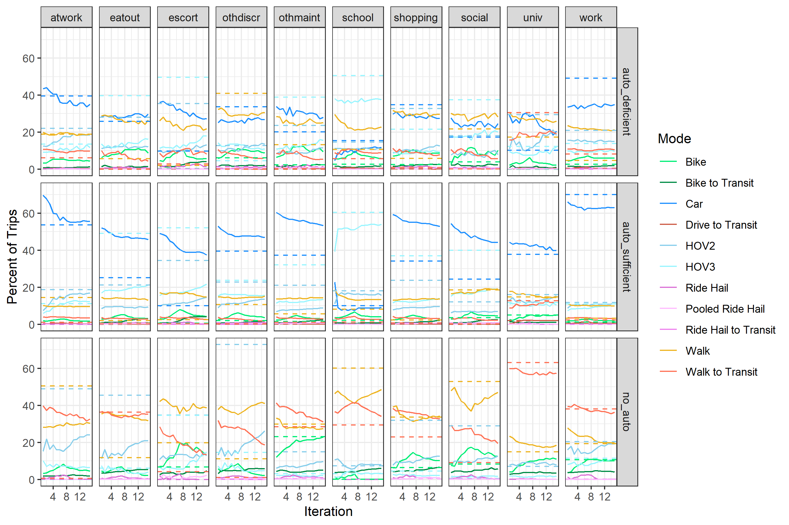

```{r, include = FALSE}
library(targets)
library(tarchetypes)
library(tidyverse)
library(data.tree)
library(knitr)
library(kableExtra)
library(DiagrammeR)

# Instructions and options =========
# prints missing data in tables as blank space
options(knitr.kable.NA = '') 
# tells kableExtra to not load latex table packages in the chunk output
options(kableExtra.latex.load_packages = FALSE) 

# options for latex-only output
if(knitr::is_latex_output()) {
  knitr::opts_chunk$set(echo = FALSE, warning = FALSE, message = FALSE)
} 
```

# Methods
We developed a series of experiments to understand the relative importance of activity-based and multi-agent simulation in forecasting the uptake of novel modes. These experiments were performed using ActivitySim as the activity-based model and BEAM as the multi-agent simulation tool. We used the Salt Lake City, Utah region as a case study for our experiments. Since ride hailing vehicles were an emerging technology in the region at the time of our study, we deemed it the appropriate novel transport mode to model in our experiments. The following section outlines the methodology for which we were able to model a novel transport mode with differing activity-based model and multi-agent simulation mode choice combinations.

## ActivitySim as the Activity-based Model {#meth-asim}
ActivitySim is an activity-based simulator used to generate plans for millions of agents each with their own demographic attributes [@gali08]. Instead of independently modeling each trip, ActivitySim simulates each individual by calculating their daily travel diaries and schedules. Long term decisions are made first, and then shorter term decisions are calculated based on those long term decisions [@rsg21]. Overall, ActivitySim is an advanced activity-based model with the same advantages and disadvantages described in Section \@ref(lit-abm).

### Novel Modes in ActivitySim
ActivitySim was chosen as the activity-based model in this research because built into its framework are the novel modes of ride hail and pooled ride hail. Specifically, ride hail and pooled ride hail fall under one of the four nested tiers of ActivitySim's nested logit model. This means that ride hail is a unique modal option not characterized by being an auto, non-motorized, or transit type mode. Figure \@ref(fig:fig-asim-nest) displays the four tiers of the nested logit along with the modal alternatives of each tier [@mtc12]. These modal alternatives represent the alternatives available in both ActivitySim's tour based and trip based mode choice model. When determining the mode to use on a trip, ActivitySim first calculates the tour mode and subsequently calculates the trip mode based on the tour mode selection (See Figure \@ref(fig:fig-mode-compare)). Person attributes, path attributes, location attributes, tour purpose value, and more all play a role in calculating the mode choice decision. 

```{r fig-asim-nest, fig.cap = "ActivitySim Nested Logit Model.", fig.asp=1, fig.align='center', out.extra = 'trim = {5cm 6.5cm 12.5cm 4cm}', out.width=".7\\textwidth", wrapfigure = list("R", .5),  echo=FALSE}
choice <- Node$new("Choice")
  auto <- choice$AddChild("Auto")
    drivealone <- auto$AddChild("Drive-Alone")
    sharedride2 <- auto$AddChild("Share-Ride 2")
    sharedride3 <- auto$AddChild("Shared-Ride 3+")
  nonmotorized <- choice$AddChild("Non-Motorized")
    walk <- nonmotorized$AddChild("Walk")
    bike <- nonmotorized$AddChild("Bike")
  transit <- choice$AddChild("Transit")
    walkaccess <- transit$AddChild("Walk-Transit")
    driveaccess <- transit$AddChild("Drive-Transit")
  ridehail <- choice$AddChild("Ride-Hail")
    taxi <- ridehail$AddChild("Taxi")
    tnc_single <- ridehail$AddChild("Ride-Hail Single")
    tnc_shared <- ridehail$AddChild("Ride-Hail Shared") 
#print(choice)

SetNodeStyle(choice, style = "filled,rounded", shape = "box", fontname = "helvetica", tooltip = GetDefaultTooltip)
plot(choice)
```

In addition to using specific attributes to determine the mode choice decision, ActivitySim also sets default parameters for choosing ride hail and pooled ride hail vehicles. For example, a base fare, cost per mile, cost per minute, and cost minimum are all set before model runs. These values can be changed between model runs, but are held constant for all ride hail vehicles in the same model run. In addition, a mean wait time is used to help calculate the total travel time of ride hail vehicles. This means that all mode choice decisions to choose ride hail vehicles use the same wait time in the utility calculation. There is no variability in wait time between one agent using ride hail against another. One exception however, is that there are 5 different mean wait time values depending on the location of the ride hail request. Mean wait times also differ between single ride hail trips and shared ride hail trips. There is also one parameter for the maximum allowed wait time for a ride hail vehicle. Overall, it was essential to use ActivitySim to model ride hail vehicles because the mode choice structure fostered accurate behavioral representation and modal consistency between trips. However, ActivitySim's absence in using variable wait time to calculate the ride hail choice utility led us to also modeling ride hail vehicles with a multi-agent simulation (See Section \@ref(meth-beam)).

### ActivitySim Configured to the Case Study Region
ActivitySim was configured to the case study region by first gathering and generating the input data. Three input files were necessary in order to run ActivitySim:

  1. A synthetic population of the agents within the study area.
  2. A zonal socioeconomic data file describing the characteristics of each zone.
  3. A set of skims that describe the cost and travel times of all modes between all zones.
  
A synthetic population is a generated population with specific individual attributes that add up to the regional characteristics as a whole. We generated the synthetic population using a software called PopulationSim [@popsim]. We used a "seed" table, which represented information of a subset of the population, and a set of "targets", which represented demographic data of smaller areas of the region, to run PopulationSim [@nate]. The zonal socioeconomic data file stores zonal characteristics regarding household, worker, and other activity type information. This file was created using data from Wasatch Front Regional Council (WFRC) [@wfrc], Utah Automated Geographic Reference Center [@agrc], and the synthetic population when necessary. The skims are large matrices showing travel times and costs between every set of zones within the area of study. Included in these skims were further details regarding differences in modes, distances, wait times, etc. [@nate]. We used pre-generated skims from @wfrc, with some slight adjustments, in our run of the ActivitySim model.

After generating the necessary input files, we calibrated and validated the ActivitySim model to better represent decisions made in the Salt Lake region. The process of calibrating and validating the ActivitySim model to the Salt Lake region was conducted by @nate. The purpose of the calibration and validation was to ensure that the outputs generated by ActivitySim matched target regional values. Specifically, trip productions, trip distributions, and mode choices were tested to match the given target values from the four-step model from @wfrc. The details behind the exact calibration and validation process are discussed by @nate, and therefore will not be described in detail within this paper. However, we did conduct one additional calibration measure beyond that which @nate completed. Due to some slight adjustments made after the initial calibration of ActivitySim, we elected to re-calibrate ActivitySim's tour mode choice parameters. Using the 2012 household travel survey as our targets, we improved ActivitySim to model a more accurate total modal distribution of the region [@wfrc]. The fully calibrated and validated ActivitySim model was then ready to run and generate activity plans for the case study region.

## BEAM as the Multi-agent Simulation Tool {#meth-beam}
BEAM stands for Behavior, Energy, Autonomy, and Mobility and is a multi-agent simulation tool being developed by Lawrence Berkeley National Laboratory and UC Berkeley Institute for Transportation Studies [@beam]. As an extension of MATSim, it simulates individual agents using both within day replanning and across-day replanning to maximize individual utility. Overall, BEAM shares many of the same advantages and disadvantages of most multi-agent simulations as described in Section \@ref(lit-mas).

### Novel Modes in BEAM
BEAM was chosen as the multi-agent simulation in this research because of its integration with transportation network companies (TNCs), or ride hail and pooled ride hail vehicles. (BEAM also supports plug-in electric vehicle modeling, however, this feature was not used within our research.) Along with the TNC type mode options, BEAM supports many of the regular choices as well, such as car, walk, bike, walk-to-transit, and drive-to-transit.  Default BEAM uses a simple multinomial logit choice model for determining which mode any particular agent will use on any particular trip. Only a few variables are used to calculate the modal alternative: cost, travel time, number of transfers, and an alternative specific constant (ASC) [@beam].

BEAM was also chosen as the multi-agent simulation in this research because of how it implements ride hailing vehicles. BEAM uses a greedy asynchronous ride hail matching algorithm that also supports pooled trips. The algorithm works by first, requiring agents to send a request for a ride hail vehicle, and then by second, matching the closest vehicle to that agent. For the algorithm to work, BEAM requires the modeler to input a ride hail vehicle fleet. This fleet is a simply file that describes the number of ride hailing vehicles available in the region, their starting locations, their working hours, their seating capacity, and other specifications. BEAM assigns these vehicles to the roadway network, where they "roam" the streets awaiting requests. The ride hail algorithm permits a more realistic ride hail modeling structure. For example, agents make a request to take a ride hail vehicle, expect a variable wait time dependent on their geographic location, and may not even be able to take the vehicle if there is no availability! All these attributes are similar to how using ride hail is in real life, and represent the true advantages to modeling ride hail with BEAM. 

### Linking the Mode Choice of ActivitySim and BEAM {#meth-beam-link}
In order to use BEAM in conjunction with ActivitySim, however, its mode choice model was updated to be more consistent with ActivitySim’s mode choice model. More specifically, three changes were made to the choice structure:

  1. Adding a Tour Purpose Attribute
  2. Adding Person, Path, and Location Attributes to the Utility Equation
  3. Adding New Modal Alternatives
  
First, a tour purpose attribute was added at the trip level, to be used when making trip-based modal decisions. ActivitySim's default utility parameters are segmented by tour purpose, auto ownership, and mode; therefore, adding a tour purpose level attribute was essential to calculating the mode choice utility similar to ActivitySim. 

Second, multiple person, path, and location related attributes were added to use in the mode choice utility equations. The MTC example of Activityim (the example referenced in this research) uses 25 different variables in the utility calculation [@mtc12]. So, BEAM was adjusted to use values like wait time, transit proximity, distance, age, household size, and more on top of the default variables to calculate modal utility. This was done by gathering path and location variables from the BEAM router and person level variables from the input files. ASCs were copied directly from the MTC ActivitySim example, and then calibrated later on. Overall, one input file was created which housed all path, person, and location type parameters on a tour purpose, auto ownership, and modal level. 
The last major adjustment made to the BEAM software was adding new modal alternatives. The most important difference between the ActivitySim modal options and the BEAM modal options is the inclusion of carpooling vehicles (HOV2 and HOV3). HOV2 means High Occupancy Vehicle with 1 passenger (2 people in the vehicle) and HOV3 means High Occupancy Vehicle with 2 or more passengers (at least 3 people in the vehicle). The BEAM software was adjusted to include HOV2 and HOV3 type modes, including a distinction between drivers and passengers of those vehicles. Within the code, HOV2 and HOV3 modes were provided as modal options by transforming an existing car option into an HOV option. This allowed car travel statistics to be transferred over to the carpooling modes, which were essential to calculating the utility.

BEAM's default mode choice model was adjusted dramatically to be more closely aligned with how the MTC example of ActivitySim handles mode choice [@mtc12]. As a way to better understand the complexity of the new mode choice model in BEAM, two pseudocode algorithms are provided. Specifically, the algorithms are meant to provide clarification on how BEAM's new mode choice model works.

Algorithm 1 describes the process behind determining the mode choice alternatives for each agent. This process occurs for every agent for every trip. Two procedures are presented within the first algorithm. The first procedure is called DetermineHOVAlternatives. This procedure was added to the BEAM code as a way to include carpooling options. In this procedure the HOV alternatives are created from already existing options created by the R5 router [@r5]. (The R5 routing engine helps BEAM accomplish multi-modal routing). Basically if a car, HOV2, or HOV3 mode is already created from the router, then both HOV2 and HOV3 options are provided. If car is not provided by the router, then passenger HOV options are provided. Passenger HOv modes, called HOV_TELEPORT, are completed by teleporting agents from origin to destination. The second procedure within Algorithm 1 describes the process behind determining the final modal alternatives. It essential states that if the current mode is already chosen, then that mode remains as the only alternative to choose from. However, if no mode is currently chosen for the trip, the router, ride hailing, and HOV alternatives are combined and presented as the final alternatives to choose from. 

\begin{algorithm} [tph]
\caption{Algorithm for Determining Mode Choice Alternatives in BEAM}
\begin{algorithmic}[1]
\Require
\State $i : origin$
\State $j : destination$
\State $n: agent$
\State $N: population$
\State $t : trip $
\State $P : plan$
\State $\vec{R}(i,j) : Router\: alternatives$
\State $\vec{RH}(i,j) : Ridehail\:alternatives$
\State $\vec{H}(i,j) : HOV\:alternatives$
\State $\vec{M}(i,j) : Final\:modal\:alternatives$
\State $C : Current\:Mode$
\State $I : Trip\:Index$
\vspace{4pt}\hrule\vspace{5pt}

\State $\vec{R} \equiv \vec{R}(i,j)$
\State $\vec{RH} \equiv \vec{RH}(i,j)$
\State $\vec{H} \equiv \vec{H}(i,j)$
\State $\vec{M} \equiv \vec{M}(i,j)$
\For {$n \in N$}
\For {$t \in P$}

\Procedure {DetermineHOVAlternatives}{$\vec{R}$, $C$}
\If {$C=None$}
  \If {$\vec{R} \ni CAR$}
    \State $\vec{H} \gets (HOV2,HOV3)$
  \ElsIf {$\vec{R} \ni HOV2$}
    \State $\vec{H} \gets (HOV3)$
  \ElsIf {$\vec{R} \ni HOV3$}
    \State $\vec{H} \gets (HOV2)$
  \ElsIf {$\vec{R} \ni WALK$}
    \State $\vec{H} \gets (HOV2\_TELEPORT, HOV3\_TELEPORT)$
  \EndIf
\Else
  \State $\vec{H} \gets None$
\EndIf
\EndProcedure
\Statex
\algstore{myalg}
\end{algorithmic}
\end{algorithm}

\addtocounter{algorithm}{-1}
\begin{algorithm}
\caption{continued}
\begin{algorithmic} [1]
\algrestore{myalg}
\Procedure {DetermineFinalModalAlternatives}{$\vec{R}$, $\vec{RH}$, $\vec{H}$, $C$, $I$}
\If {$C = DRIVE\_TRANSIT \lor BIKE\_TRANSIT$}
  \If {$I = 0$}
    \If {$C = DRIVE\_TRANSIT$}
      \State $\vec{M} \gets (DRIVE\_TRANSIT)$
    \Else
      \State $\vec{M} \gets (BIKE\_TRANSIT)$
    \EndIf  
  \Else
    \State $\vec{M} \gets (WALK\_TRANSIT, RIDEHAIL\_TRANSIT)$
  \EndIf
\ElsIf {$C = WALK\_TRANSIT \lor RIDEHAIL\_TRANSIT$}  
  \If {$C = WALK\_TRANSIT$}
    \State $\vec{M} \gets (WALK\_TRANSIT)$
  \Else
    \State $\vec{M} \gets (RIDEHAIL\_TRANSIT)$
  \EndIf
\ElsIf {$C = HOV2\_TELEPORT \lor HOV3\_TELEPORT$}  
  \If {$C = HOV2\_TELEPORT$}
    \State $\vec{M} \gets (HOV2\_TELEPORT)$
  \Else
    \State $\vec{M} \gets (HOV3\_TELEPORT)$
  \EndIf
\ElsIf {$C = CAR$}
  \State $\vec{M} \gets (CAR)$
\Else
  \State $\vec{M} \gets \vec{R} + \vec{RH} + \vec{H}$  
\EndIf  
\EndProcedure
\EndFor
\EndFor
\Statex
\end{algorithmic}
\end{algorithm}

Algorithm 2 describes the process within BEAM for how one modal alternative is selected among all the mode choice options. Algorithm 2 is basically the pseudocode behind the process that occurs with the mulitnomial logit function. Then, after using the multinomial logit formula, the probabilities that were calculated are sampled and one final mode choice alternative is selected!

\begin{algorithm}
\caption{Algorithm for Selecting Final Modal Alternative in BEAM}
\begin{algorithmic}[1]
\Require
\State $i : origin$
\State $j : destination$
\State $n: agent$
\State $N: population$
\State $t : trip $
\State $P : plan$
\State $\vec{A}: attributes\:of\:agent$
\State $a: attribute\:value$
\State $\vec{M}(i,j) : Modal\:alternatives$
\State $m : alternative \in M(i,j)$
\State $\vec{U}(\vec{M}(i,j),\vec{A}):Utilities\:for\:alternatives$
\State $u: utility \in \vec{U}(\vec{M}(i,j),\vec{A})$
\State $\vec{c}: attribute\:coefficients$
\State $\mathds{P}: probability$
\State $Mode: chosen\:mode\:for\:agent\:(n)\:on\:trip\:(t)$
\State $f(\vec{X}):$
This function takes a vector of modes and  their probabilities of being chosen. With those probabilities it builds them into a cumulative distribution function, generates a random number and then drops the mode with the closest probability. This process continues until only one mode is left.
\vspace{4pt}\hrule\vspace{5pt}

\State $\vec{M} \equiv \vec{M}(i,j)$
\State $\vec{U} \equiv \vec{U}(\vec{M},\vec{A})$
\For {$n \in N$}
\For {$t \in P$}\Procedure {DetermineFinalModalAlternative}{$\vec{M}$, $\vec{A}$, $\vec{c}$}
\For {$m \in \vec{M}$}
  \State $u \gets \sum_{a\in \vec{A}} a \times c_a$
  \State $\vec{U} += [m,u]$
\EndFor
\State $S \gets \sum_{u\in \vec{U}}e^u$
\For {$u \in \vec{U}$}
    \State $\mathds{P}(u)\gets e^u / S$
    \State $\vec{B} +=[m, \mathds{P}(u)]$
\EndFor 

\State $Mode \gets f(\vec{B})$

\EndProcedure

\EndFor
\EndFor
\Statex
\end{algorithmic}
\end{algorithm}


### BEAM Configured to the Case Study Region
BEAM was configured to the case study region by gathering the inputs, validating the utility parameter values, and calibrating the utility ASC values to the region. Gathering the BEAM input files were easy simply because the outputs generated by the calibrated ActivitySim model were used as the inputs to BEAM. Only a slight formatting change was made to these inputs; and since they were generated by the calibrated ActivitySim model, they were already configured to the Salt Lake region. 

The utility parameter values used in BEAM's new mode choice model were copied directly from MTC's implementation of ActivitySim [@mtc12]. MTC's implementation of ActivitySim was designed for the San Francisco, California region. Logically, travel behaviors such as travel time, travel distance, and number of transfers should affect people in different regions in similar ways. However, as a way to validate the use of ActivitySim's path utility coefficients in the Salt Lake region, these values are compared to values from the Utah Statewide model, the WFRC travel demand model, and the NCHRP Report 716. The Utah Statewide model is useful as it provides a rough idea of the influence of path variables in Utah as a whole [@utahstate]. The WFRC model model is a useful comparison as it predicts travel behavior for the same region of study used in this research project [@wfrc] . NCHRP Report 716 provides a rough idea of what parameter values should look like for a generalized modeling point of view [@nchrp]. Overall, comparing these three sets of path parameter values with the MTC ActivitySim parameter values used in BEAM helps ensure that the the utility parameters are valid.

Figure \@ref(fig:hbw) shows the comparison of the path utility parameter values between all four models for home-based work trips. For the egress time, in vehicle travel time (IVTT), the number of transfers, transfer time, and the wait times, MTC's ActivitySim seems to use a very similar coefficient value as the other three models. The largest discrepancy exists with short and long walking distances. ActivitySim seems to use a value almost ten fold that of the other models. This occurs because the WFRC and Utah Statewide models caps walking distance whereas ActivitySim instead gives a high penalty for long walking distances. With this clarification, it is clear to see that ActivitySim's path coefficient values do not require calibration and were left as is.

```{r hbw, echo = FALSE, warning = FALSE, message = FALSE, fig.cap = "Home-based work mode choice path coefficients model comparison.", fig.align='center'}
tar_read(hbw_graph)
```

Figure \@ref(fig:hbs) shows the comparison of the path utility parameter values between all four models for home-based school trips. Similar to the home-based work analysis, for the egress time, IVTT, transfer time, and the wait times, ActivitySim seems to use a very similar coefficient value as the other three models. Again, the largest discrepancy exists with short and long walking distances. Since this is simply a difference between how walk distance is modeled, the discrepancy is ignored. In addition, the other three models did not have information on number of transfers. As a result, there is no comparison done with number of transfers. ActivitySim's path coefficient values do not require calibration for the home-based school parameters.

```{r hbs, echo = FALSE, warning = FALSE, message = FALSE, fig.cap = "Home-based school mode choice path coefficients model comparison.", fig.align='center'}
tar_read(hbs_graph)
```

Lastly, Figure \@ref(fig:hbo) shows the comparison of path utility parameter values between all four models for home-based other trips. Again, besides for walk distance all variables seem to be similar between all four models. An interesting point is that for models other than ActivitySim, the cost coefficient varies greatly. Fortunately, ActivitySim bases the cost coefficient on each individual's value of time so this is not a concern. Overall, for all purpose types the coefficients used by ActivitySim are similar enough to other models that exist, and therefore do not require calibration. 

```{r hbo, echo = FALSE, warning = FALSE, message = FALSE, fig.cap = "Home-based other mode choice path coefficients model comparison.", fig.align='center'}
tar_read(hbo_graph)
```

After validation was completed, the last step in order to run BEAM with the case study region was to calibrate the ASC values of the mode choice model. BEAM calibration was completed by iteratively updating the ASC values using Equation \@ref(eq:eqcalib). The number of trips totaled by tour purpose, auto ownership, and modal alternative were compared between the BEAM results and the ActivitySim results and used to adjust each ASC value. After 15 iterations of Equation \@ref(eq:eqcalib) were completed on the ASC values, the BEAM trip values were within a reasonable range to the ActivitySim target shares. Figure \@ref(fig:fig-beam-calib) shows the progress of the calibration targets with the final shares after each iteration. 

\begin{equation}
  NewASC = OldASC + ln(\frac{Trips_{ASIM}}{Trips_{BEAM}}) (\#eq:eqcalib)
\end{equation}  

```{r fig-beam-calib, out.width='100%', fig.cap='BEAM mode choice ASC calibration', out.width='100%', fig.asp=1, fig.align='center', echo=FALSE}

```


## Case Study Scenarios
After BEAM validation and BEAM calibration were completed for the case study region, a series of different BEAM experiements were run. Each experiment was run for a total of 12 iterations using a 15% population size. Ten different experiments were conducted, each with a unique ActivitySim-to-BEAM mode choice combination. Table \@ref(tab:tbexperiments) provides a short description of the 10 different scenarios. 

```{r, display=FALSE,echo=FALSE,warning=FALSE,include=FALSE}
# Scenario Number, Scenario Name, ActivitySim Modal Options, BEAM Modal Options, BEAM Utility Function Variables, Scenario Description 
input <- c("1", "wRH-None", "All Modes","No Modes","N/A","BEAM run using ActivitySim output plans that include ride hail modes; mode innovation is turned off / mode choice remains static ",
           "2", "wRH-AllModes-AllVars", "All Modes", "All Modes","Path, Person, Location", "BEAM run using ActivitySim output plans that include ride hail; all variables are used in the utility equation; all modes are available for selection",
           "3", "wRH-AllModes-PathVars", "All Modes","All Modes","Path", "BEAM run using ActivitySim output plans that include ride hail; only path variables are used in the utility equation; all modes are available for selection",
           "4", "wRH-RHModes-AllVars", "All Modes", "Ride Hail Modes Only", "Path, Person, Location", "BEAM run using ActivitySim output plans that include ride hail; all variables are used in the utility equation; mode innovation is turned off for all trips except non-car trips, which have the option to change to ride hail",
           "5", "wRH-RHModes-PathVars", "All Modes", "Ride Hail Modes Only", "Path", "BEAM run using ActivitySim output plans that include ride hail; only path varibales are used in the utility equation; mode innovation is turned off for all trips except non-car trips, which have the option to change to ride hail",
           "6", "noRH-None", "All Modes except Ride Hail", "No Modes", "N/A", "BEAM run using ActivitySim output plans that don't include ride hail; mode innovation is turned off / mode choice remains static",
           "7", "noRH-AllModes-AllVars", "All Modes except Ride Hail", "All Modes", "Path, Person, Location", "BEAM run using ActivitySim output plans that don't include ride hail; all variables are used in the utility equation; all modes are available for selection",
           "8", "noRH-AllModes-PathVars", "All Modes except Ride Hail", "All Modes","Path", "BEAM run using ActivitySim output plans that don't include ride hail; only path variables are used in the utility equation; all modes are available for selection",
           "9", "noRH-RHModes-AllVars", "All Modes except Ride Hail", "Ride Hail Modes Only", "Path, Person, Location", "BEAM run using ActivitySim output plans that don't include ride hail; all variables are used in the utility equation; mode innovation is turned off for all trips except non-car trips, which have the option to change to ride hail",
           "10", "noRH-RHModes-PathVars", "All Modes except Ride Hail", "Ride Hail Modes Only", "Path", "BEAM run using ActivitySim output plans that don't include ride hail; only path variables are used in the utility equation; mode innovation is turned off for all trips except non-car trips, which have the option to change to ride hail")
inputTable <- matrix(input,ncol=6,byrow=TRUE) %>%
  as.tibble() %>% 
  rename("Scenario Number" = V1, "Scenario Name" = V2, "ActivitySim Mode Options" = V3, "BEAM Mode Options" = V4, "BEAM Utility Variables" = V5, "Scenario Description" = V6)

```

```{r tbexperiments, echo=FALSE}
kable(inputTable, caption = 'ActivitySim-to-BEAM Mode Choice Combination Scenarios', booktabs = TRUE) %>%
  kable_styling(latex_options="scale_down") %>%
  column_spec(1, width = "4em") %>%
  column_spec(c(2,3,4,5), width = "8em") %>%
  column_spec(6, width = "25em")
  
```

Three different mode choice adjustments help describe the setup of each experiment. The first descriptor references how ActivitySim's modes were configured, which in Table \@ref(tab:tbexperiments) is labeled as "ActivitySim Mode Options". Only two options are available: "All Modes" and "All Modes except Ride Hail". To explain, ActivitySim was run two times, one with ride hail alternatives turned on and one with ride hail turned off. In other words, the ride hail nesting option as shown in Figure \@ref(fig:fig-asim-nest) existed in one run of ActivitySim ("All Modes"), whereas in the other it did not ("All Modes except Ride Hail"). Since the daily activity plans generated by ActivitySim were converted to BEAM inputs, this descriptor also explains the initial mode choice selections for all trips entered into BEAM. Two different plans files were used to running BEAM: one plans file included some trips with ride hail modes whereas the other plans file included no trips with ride hail modes. By creating this distinction, we hope to better understand how heavily a multiagent simulation prioritizes ride hail as opposed to an activity-based model.

The second descriptor present in Table \@ref(tab:tbexperiments) is labeled as "BEAM Mode Options" and explains the modal alternatives available for choice within BEAM. Three different variations were used: "No Modes", "All Modes", "Ride Hail Modes Only". The "No Modes" category represents a run of BEAM where all modal innovation was turned off. This means that no mode choice was available, and the modes from the initial input plans remained constant across each iteration. The "All Modes" category however, represents a run of BEAM where modal innovation was turned on, and all modal alternatives were available for choice. This meant that within-day replanning as well as across-day replanning was turned on, and agents could change their trip modes to maximize their utility. Lastly, the "Ride Hail Modes Only" category represented a run of BEAM where modal innovation was partially turned off. All trips that originally took car or carpool modes had modal innovation turned off; their modes were locked. All trips that originally took walk-transit or drive-transit modes, however, were given the option to switch to ride hail transit. Also, all walk modes were given the option to switch to ride hail. "Ride Hail Modes Only" represented the version of BEAM where ride hail and ride hail transit modes were given to non-car dependent agents. Overall, by using different mode choice structures within BEAM, we hope to better understand how altering available modal alternatives affects ride hail service capabilities. 

Finally, the third descriptor present in Table \@ref(tab:tbexperiments) is labeled as "BEAM Utility Variables" and explains which utility variables were used to calculate modal utility. Three difference variations were present: "N/A", "Path, Person, Location", and "Path". The "N/A" option means no utility parameters were used in determining mode choice, because modal innovation as turned off completely. The "Path, Person, Location" option represented the version of BEAM that used all utility parameter types to calculate the mode choice utility. As ActivitySim uses path, person, and location type variables to determining modes, this version of BEAM also uses all three types of variables. Section \@ref(meth-beam-link) describes how BEAM was configured to use all these variable types. The "Path" option represented the version of BEAM that only used path type utility parameters to calculate mode choice utility; the location and person type variables were not used. By altering which variables were used in the utility equation, We hope to better understand the effect different types of utility parameters have on mode choice and ride hail service capabilities.

Overall, we ran 10 different scenarios each with a slightly different ActivitySim-to-BEAM mode choice combination. Each scenario is built from which modes were included in the input plans, which modal alternatives were available for choice, and which utility parameter types were used to calculate the mode choice utility. By altering these three different mode choice characteristics, we hope to better understand the affect a linked activity-based model and multiagent simulation have on the service capabilities of a novel mode. 
