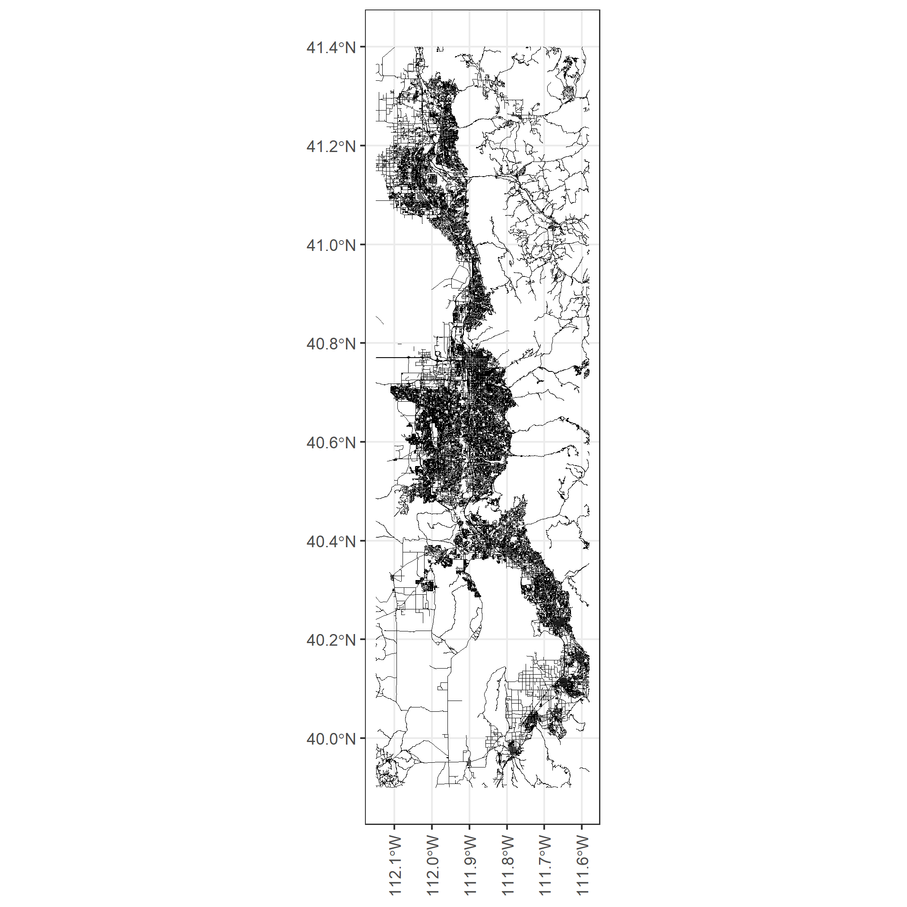

---
header-includes:
  - \usepackage{algorithm}
  - \usepackage{algpseudocode}
  - \usepackage{dsfont}
---

```{r, include = FALSE}
library(tidyverse)
library(sf)
library(tidyverse)
library(cowplot)
library(ggspatial)
library(DiagrammeR)
```

# Methods

## Overview
A systematic approach to determine the effects of a consistent mode choice model between an activity-based model and a microsimulation tool requires four two main steps. The first step involves creating a test scenario that runs within the activity-based model ActivitySim and the microsimulation tool BEAM. Section \@ref(mscen) explains this step including how the test scenario was created and how ActivitySim and BEAM were configured. The second step involves adjusting the internal code of BEAM to align the mode choice model with that of ActivitySim's. Section \@ref(mbeam) explains the details behind the changes made to BEAM's default mode choice model to align more closely with that of ActivitySim's. The third step is to calibrate the mode choice utility values within BEAM. Section \@ref(mcalib) explains the details behind the calibration of the mode choice parameters. The last step is to compare the modal distributions between different mode choice models, which is explained in Section \@ref(mcomp).

## Creating and Setting up the Test Scenario  {#mscen}
Designing a test scenario to use within ActivitySim and BEAM was essential to understanding and testing mode choice between models. This section explains the region that was used to model the test scenario. This section also explains how the input files needed to run both ActivitySim and BEAM were generated for the test scenario.

### Test Scenario Region
The test scenario used in this research includes the approximate 2.5 million agents of the Salt Lake City, Utah, USA region. This region includes the Box Elder, Davis, Salt Lake, Utah, and Weber counties. Figure \@ref(fig:figregion) shows the 2881 Traffic Analysis Zones (TAZs) along with the five counties that make up the region of study. 

```{r, include = FALSE, eval = FALSE}
sf_use_s2(FALSE)
geo <- st_read('https://raw.githubusercontent.com/byu-transpolab/populationsim_wfrc/master/inputs/taz.geojson') %>%
  st_transform(crs = 4326) %>%
  filter(CO_FIPS != 0)
utah <- st_read("data/Utah_State_Boundary-shp/Utah.shp") %>%
  st_transform(crs = 4326) %>%
  head(1)

map1 <- ggplot() + 
  annotation_map_tile() +
  geom_sf(data = geo, mapping = aes(color = factor(CO_FIPS))) +
  scale_color_brewer(labels = c("Box Elder", "Davis", "Salt Lake", "Utah", "Weber"), palette = "Dark2") +
  theme_bw() +
  guides(color=guide_legend("County")) + 
  theme(axis.text.x = element_text(angle = 90, vjust = 0.5, hjust=1))

map2 <- ggplot() +
  geom_sf(data = utah, fill = "white") +
  coord_sf(xlim = c(-115, -108.25), ylim = c(36.4, 42.5), expand = FALSE) +
  theme_void() + 
  annotate(geom = "rect", ymax = 41.4, ymin = 39.9, xmax = -112.3, xmin = -111.4, colour = "red", fill = NA)

taz <- ggdraw() + 
  draw_plot(map1) + 
  draw_plot(map2, x = 0.025, y = 0.65, width = 0.3, height = 0.3) + 
  theme_bw()
ggsave("pics/taz.png",map1)
```

```{r figregion, fig.cap='The TAZs of each county in the region of study.', out.width = "480px", echo = FALSE, warning = FALSE, message = FALSE, fig.align='center'}

```

This extensive region was selected for the following reasons:

  1. There is substantial data that exists for this region. Having sufficient data points for each of the TAZs was essential to creating the inputs to ActivitySim and BEAM. The majority of the data used for this research was gathered and shared by Wasatch Front Regional Council (WFRC), the Metropolitan Planning Organization (MPO) of Salt Lake county. 
  2. There currently exists a need to analyze this region with a microsimulation tool, such as BEAM. Specifically, the Utah Transit Authority (UTA) wishes to understand what specific sub regions in the Salk Lake area will best serve new on-demand transit vehicles. In some future research, this specific question will be answered. Along this this question, having a microsimulation model of a region will prove to be an effective method to answering multiple transportation service questions in the future. To date, only one previous analysis of this region has been conducted with the BEAM software [@nate].
  3. The size and population within the study area are comparable to other regions around the United States. This means that the work completed in this research may be useful to other cities besides Salt Lake City.
  4. The project researchers live in this region, and therefore have real life knowledge of how transportation works in the region. This allows the researchers to compare the the results of the models with their own experiences, hopefully providing extra verification.
  
Overall, the Salt Lake City, Utah region proved to be an effective location for this mode choice analysis research. After selecting the region of study, the next steps involved seting up and running ActivitySim. 
 
### Setting up and Running ActivitySim
Setting up and running ActivitySim for the Salt Lake region was an arduous task. The entire process for setting up the activity-based model for this region is explained in the research done by @nate. The research done by @nate was the basis to the work completed in this project.

However, a brief explanation of the setup of the activity-based model is explained in Section \@ref(asiminput). The two main steps behind creating an activity-based mode for the Salt Lake region was creating corresponding input files and calibrating and validating the results.

#### Creating Input Files {#asiminput}
ActivitySim requires the following three input files in order to run:

  - A synthetic population of the agents within the study area.
  - A zonal socioeconomic data file describing the characteristics of each zone.
  - A set of skims that describe the cost and travel times of all modes between all zones.

The synthetic population is used to generate an entire population with specific individual details for each agent (like gender, age, income, vehicle ownership). Gathering individual information for all the agents in the region may be considered an invasion of privacy. So instead a synthetic population is used. The synthetic population is a generated population with specific individual attributes that add up to the regional characteristics as a whole. The synthetic population was generated using a software called PopulationSim [@popsim]. To run PopulationSim a "seed" table and a set of "targets" were used. The "seed" table represented information about a subset of the population and the set of "targets" represented demographic data for smaller areas within the region [@nate]. Together, PopulationSim was able to simulate individual attributes for the approximate 2.5 million agents in the Salt Lake region.

The zonal socioeconomic data file stores zonal characteristics regarding household information, worker information, and other activity type information. This file specifically gives information on what types and how many types of activities may be found within a certain zonal region. This file was created using data from WFRC, Utah Automated Geographic Reference Center [@agrc], and the synthetic population when necessary.

The third input to ActivitySim is detailed travel skims. Skims are large matrices showing travel times and costs between every set of zones within the area of study. Included in these skims were further details regarding differences in modes, distances, wait times, etc. [@nate]. The existing skims from WFRC were used along with some slight adjustments to fit the ActivitySim model. 

#### Calibration and Validation {#asimcal}
The calibration and validation of ActivitySim was conducted by @nate. The purpose of the calibration and validation was to ensure the outputs generated by ActivitySim matched target regional values. Specifically trip productions, trip distributions, and mode choices were tested to match the given target values from WFRC's four-step model. 

To validate the trip productions, total trips per county were compared between ActivitySim and WFRC target values. These trips were close to identical, with only a variation of 1.0 percent. The trip distributions were compared as well, with about a 4.0 percent margin of error. Overall, @nate shows that the trip productions and distributions of the ActivitySim model were a good representation of travel behavior, requiring no calibration.

The mode choice validation was difficult as the mode choice categories between WFRC and ActivitySim are vastly different. ActivitySim considers five trip mode choice alternatives whereas the WFRC model considers 10 trip mode choice alternatives. However, ActivitySim does include 10 tour mode choice alternatives. When comparing mode choice distributions, both the trip and tour distributions from ActivitySim were compared with the trip distributions of WFRC. @nate performs an in depth comparison between these values and found that ActivitySim underrepresents non-motorized university trips and overrepresents non-motorized work trips. In addition ActivitySim underrepresents shared ride trips for all tour purposes and  does not accurately represent commuter rail and local bus trips for all tour purposes. overall, the mode choice model did not match closely with the WFRC targets, and required further calibration. 

@nate performed an in depth calibration across ActivitySim modes to minimize error with the WFRC target shares. The calibration process will not be explained in this research paper however. Upon calibration, trip productions and distributions remained relatively unchanged, and therefore needed no calibration. Mode choice distributions were closer to target values as well. Overall, after some calibration the results of ActivitySim produced sufficiently accurate information to move forward with the research.

### Setting up BEAM
After setting up, calibrating, and running the ActivitySim scenario for the Salt Lake region, the next step was setting up BEAM using the results of the ActivitySim model. BEAM requires a variety of input files, most of which are as follows:

  - A person population and corresponding person attributes files.
  - A household population with household attributes file and a vehicle fleet file.
  - Vehicle types files explaining different person vehicle types, public transit vehicle types, and ride hailing vehicle information.
  - Transportation services including a mapable street network and a file including General Transit Feed Specification (GTFS) transit information.
  - Other minor input files.
  
The BEAM input files were directly creating using the generate_beam_plans.py python script ActivitySim add on. This script was developed by the developers at Lawrence Berkeley National Lab, and allows easy csv formatted input files to BEAM. The details behind these input files along with example tables of these files are discussed and shown in the following subsections.

#### Population File
The population file was created from the ActivitySim generated data. ActivitySim's main purpose is to generate daily activity patterns (DAPs) for each agent from the synthetic population. The DAPs generated by ActivitySim consists of all the activities that each agent within the population embark on during the day. Using the activity types, activity locations, activity durations, mode choices, departure and arrival times, and overall activity data, BEAM generated a population file along with a person attributes file. 

The population file generated by the BEAM ActivitySim add-on code created a csv file describing all the events and choices each agent embarks on during the plan. For example, the plans file defines each agents home location, their activity locations, their travel and activity times, their mode choices for each trip, etc. A subsection of this file is shown in Table \@ref(tab:plans) to provide an example of some of its contents.

```{r plans, echo = FALSE, warning = FALSE, message = FALSE}
plans <- read_csv("data/plans_new.csv")%>% head(15) %>%
  select(-planIndex,-planElementType, -planElementIndex) %>%
  rename(ID = personId, Mode = legMode, Type = activityType, "End Time" = activityEndTime, Purpose = primaryPurpose, "Household ID" = householdId, LocaitonX = activityLocationX, LocaitonY = activityLocationY)
  
knitr::kable(plans, caption = 'A Subset of the Population Plans', booktabs = TRUE)
```

The person attributes file describes individual characteristics such as income, gender, age, vehicle ownership, etc. A subsection of this file is shown in Table \@ref(tab:peratt) to provide an example of some of its contents.

```{r peratt, echo = FALSE, warning = FALSE, message = FALSE}
personatt <- read_csv("data/persons.csv")%>% head(15) %>%
  select(-isFemale,-auto_ownership,-locationX,-locationY,-num_workers) %>%
  rename(ID = personId,"Household ID"=householdId,Age=age,Sex=sex,VOT=valueOfTime,Income=income,"Household Size" = hhsize, "Auto Work Ratio" = autoWorkRatio)

knitr::kable(personatt, caption = 'A Subset of the Person Attributes File', booktabs = TRUE)
```

#### Household and Vehicle Files
The household and vehicle files were generated using the same code to generate the population files. ActivitySim generates three specific files: a households, persons, and trips file. The persons and trips files were used to construct the population plans file. The households file, however, was used to generate both the household and vehicle BEAM input files. 

Within the BEAM households file, information such as household income, vehicle ownership, and the IDs of the agents and vehicles that correspond to each household ID is provided. Unfortunately, ActivitySim does not generate household coordinate locations, but does provide the TAZ in which the house presides. Therefore, the generate_beam_plans.py code designed by the BEAM developers assigns a random coordinate within the TAZ to each house. This household coordinate is then used to simulate starting and ending locations for each agent within their population plans file. An example of a subset of the households file that is used as an input to BEAM is shown in Table \@ref(tab:house).

```{r house, echo = FALSE, warning = FALSE, message = FALSE}
house <- read_csv("data/households.csv") %>% head(15) %>% filter(incomeValue != -8) %>%
  select(-auto_ownership,-num_workers) %>%
  rename("Household ID"= householdId, Income=incomeValue,"Household Size" = hhsize, "Auto Work Ratio" = autoWorkRatio, LocationX = locationX, LocationY=locationY)

knitr::kable(house, caption = 'A Subset of the Households File', booktabs = TRUE)
```

The vehicles file is quite simple in that it only includes information on the vehicle ID, vehicle type, and the household the vehicle belongs to. An example of a subset of the vehicles file that is used as an input to BEAM is shown in Table \@ref(tab:veh).

```{r veh, echo = FALSE, warning = FALSE, message = FALSE}
vehicles <- read_csv("data/vehicles.csv")%>% head(8) %>%
  rename("Vehicle ID" = vehicleId, "Vehicle Type" = vehicleTypeId, "Household ID" = householdId)

knitr::kable(vehicles, caption = 'A Subset of the Vehicles File', booktabs = TRUE)
```

#### Vechile Types Files
In addition to the household and vehicle files, two vehicle type files are also needed to run BEAM. The first describes attributes that relate to each vehicle type. For example, some attributes that are included in the vehicle types file is the fuel efficiency, seating capacity, vehicle length, etc. An example of a subset of the vehicle types file that is used as an input to BEAM is shown in Table \@ref(tab:vehtypes).

```{r vehtypes, echo = FALSE, warning = FALSE, message = FALSE}
vehicleTypes <- read_csv("data/vehicleTypes_full.csv") %>%
  select(vehicleTypeId,seatingCapacity,standingRoomCapacity,lengthInMeter,primaryFuelType,vehicleCategory) %>% 
  rename(ID = vehicleTypeId, Seats = seatingCapacity, "Standing Room" = standingRoomCapacity,"Length (m)" = lengthInMeter, Fuel = primaryFuelType, "Vehicle Type" = vehicleCategory)
  
knitr::kable(head(vehicleTypes,16), caption = 'A Subset of the Vehicle Types Input File',booktabs = TRUE)
```

A secondary vehicle types file exists that describes the nature of the ride hail fleet. One particular advantage to the microsimulation tool BEAM is its ability to model on-demand transit vehicles in a realistic manner. Part of creating realistic ride-hailing services is using an input file describing the nature of the fleet of ride-hail vehicles. An example of a subset of the ride-hail vehicle attributes file that is used as an input to BEAM is shown in Table \@ref(tab:rhveh). For this research project, the ride-hail file used was taken from an example BEAM scenario. In the future however, a ride hailing fleet file that accurately depicts the nature of ride hail vehicles in the Salt Lake region will be used. For this research it was not necessary to include, and so a default file was used instead.

```{r rhveh, echo = FALSE, warning = FALSE, message = FALSE}
rhveh <- read_csv("data/rideHailFleet.csv") %>% filter(vehicleType != "WAV") %>%  head(15) %>% mutate(id = substring(id,1,22),shifts = substr(shifts,1,10)) %>%
  select(-rideHailManagerId,-geofenceX,-geofenceY,-geofenceRadius) %>%  rename(ID = id, "Vehicle Type" = vehicleType, "Starting Point X" = initialLocationX, "Starting Point Y" = initialLocationY, "Shift Times" = shifts)
  
knitr::kable(rhveh, caption = 'A Subset of the Vehicle Types Input File',booktabs = TRUE)
```

#### Transportation Services
BEAM requires two main files in order to provide transportation services to agents within the simulation. These two files are a GTFS file and a routeable transportation network.

GTFS data is a common format that houses information relating to transportation schedules and transportation locations. Many public agencies publish transportation data in the GTFS format. The GTFS data used as the input to BEAM was obtained from UTA's mobility data feed from 2019 [@gtfs]. BEAM maps the GTFS data onto the highway network allowing agents to use both transportation and highway services interchangeably [@nate]. 

A detailed routeable road network for the study area was obtained from WFRC's travel demand model. After some manipulation, the network was cleaned of misconnections and filtered to include the correct attributes. Within the network, various attributes such as capacity, free flow speed, number of lanes, functional classification, direction, whether it is a one-way street, etc. were included. The network was constructed from a series of link and node combinations. The nodes represent intersections and activity locations whereas the links represent the roadways that connect each node. The links include the attributes of the network whereas the nodes include the coordinates. A detailed highway network of links and nodes allows BEAM to simulate traffic conditions in a more realistic manner. 

Figure \@ref(fig:network) displays the roadway network of the region of study. Figure \@ref(fig:closent) displays a close up of roadway network system within Salt Lake City, Utah to show significant detail. 

```{r, include =FALSE, eval=FALSE, fig.width=6.5, fig.height=8.5}
roads <- st_read("data/Utah_Roads/Utah_Roads.shp") %>%
  st_transform(crs = 4326)
croproads <- st_crop(roads,ymax = 41.4, ymin = 39.9, xmax = -112.15, xmin = -111.58)
cropsalt <- st_crop(roads,ymax = 40.7, ymin = 40.5, xmax = -112, xmin = -111.8)

bignetwork <- ggplot() + 
  geom_sf(data = croproads, size = .1, color = "black") +
  theme_bw() +
  theme(axis.text.x = element_text(angle = 90, vjust = 0.5, hjust=1))
ggsave("pics/network.png",bignetwork)

smallnetwork <- ggplot() + 
  geom_sf(data = cropsalt, size = .1, color = "black") +
  theme_bw() +
  theme(axis.text.x = element_text(angle = 90, vjust = 0.5, hjust=1))
ggsave("pics/smallnetwork.png",smallnetwork)
```

```{r network,  fig.cap='Transportation network for area of study.', echo = FALSE, warning = FALSE, message = FALSE, out.width = "480px", fig.align='center'}

```

```{r closent,  fig.cap='Close up of the transportation network of Salt Lake City.', echo = FALSE, warning = FALSE, message = FALSE, out.width = "480px", fig.align='center'}
knitr::include_graphics("pics/smallnetwork.png")
```

#### Other Input Files
A variety of additional input files can be included to run the BEAM simulation. Not all the files will be mentioned, but a few of them include a configuration file, a parking file, a toll prices file, TAZ specific files, and mode choice utility parameter files. Besides for the mode choice utility parameter files, details about these additional files will not be provided. The details behind the mode choice utility parameter file will be discussed in Section \@ref(mbeam).

## Improved Mode Choice in BEAM {#mbeam}
After creating the basic input files in order to run BEAM for the Salt Lake region, the next step was adjusting the mode choice model within BEAM itself. As discussed in Section \@ref(lit7) BEAM's default mode choice model is a simple multinomial logit model calculated with minimal travel attributes. In Section \@ref(lit4) it is discussed that ActivitySim's mode choice model is comprehensive.

Changing the mode choice model within BEAM to become more consistent with that of ActivitySim's required some major adjustments to BEAM's internal code. Specifically, in this research BEAM's code was changed in three significant ways. Section \@ref(purp) describes how choices were changed to be made using activity purpose values, Section \@ref(ute) describes how additional attributes were inserted to the utility equation, and Section \@ref(pool) describes how new modal alternatives were added to BEAM. Then, in Section\@ref(algo) algorithms explaining BEAM's improved mode choice model is presented.

### Purpose-based Decisions {#purp}
The first major addition to BEAM's mode choice model to improve consistency with ActivitySim was to base mode choice decisions off of activity purposes. An activity purpose describes the primary activity of trips on a tour. Primary purposes are selected on a tour-based level. For this reason, the primary purpose is also referred to as the tour purpose. For example, if an agent were to go to the gym, then to work, and then return home, each trip on the work tour would have a primary purpose of "work". In this paper, tour purpose, primary purpose, activity purpose, and tour type are all used interchangeable to mean the same thing.

ActivitySim's mode choice coefficients vary between ten different tour purposes. These tour purposes are as follows:

  - Work
  - University
  - School
  - Escort
  - Shopping
  - Eating Out
  - Social
  - Other Maintenance
  - Other Discretionary
  - At Work
  
To ensure the ability to distinguish between tour purpose values, it was necessary to adjust the population plans file to include a tour purpose trip-level attribute. Since ActivitySim bases decisions on activity purpose, it was simple to attach the attribute to the BEAM input plans file. As shown in Table \@ref(tab:plans) a purpose attribute exists. After assigning this attribute to the plans, the next step was adjusting the BEAM code to read in a new attribute. By adjusting BEAM's CSV scenario reader script, along with other scripts relating to reading inputs, the primary purpose was able to be read into the BEAM software.   

Once primary purpose values were present in the population plans, the next step was to design a new mode choice model within BEAM. In order to better understand the new code that was inserted into BEAM, three flow charts were constructed (See Figure \@ref(fig:mnlflow), Figure \@ref(fig:lccmflow), and Figure \@ref(fig:tpcmflow)). In these flow charts inputs are displayed as folder icons, Java classes and methods are displayed as rectangles, and the result is displayed as an oval. These flow charts help display the code behind the BEAM's mode choice models. Understanding BEAM's default mode choice model and its obsolete Latent Class Choice Model (LCCM) are useful toward understanding how the new Tour Purpose Choice Model (TPCM) was constructed in the BEAM code.

#### Multinomial Logit Choice Model
Figure \@ref(fig:mnlflow) shows the process behind BEAM's default mode choice model. As described in Section \@ref(lit7), by default BEAM calculates mode choices using a multinomial logit function with only a few attribute variables. In Figure \@ref(fig:mnlflow) the flow of inputs and BEAM functions are shown. As shown, the inputs to the Mode Choice Calculator are the alternatives, person and household attributes, and the destination activity data. 

```{r mnlflow,  fig.cap='BEAM code flow chart behind the default multinomial logit choice model.', echo = FALSE, warning = FALSE, message = FALSE, out.width = "600px", fig.align='center'}
#https://rich-iannone.github.io/DiagrammeR/graphviz_and_mermaid.html
DiagrammeR::grViz("digraph {
graph [layout = dot, rankdir = LR]
node [shape = rectangle, style = filled, fillcolor = Linen]

input1 [label = 'Alternatives', shape = folder, fillcolor = Beige]
input2 [label = 'Person & \n Household \n Attributes', shape = folder, fillcolor = Beige]
input3 [label = 'Destination \n Activity', shape = folder, fillcolor = Beige]
input4 [label = 'MNL Utility \n Parameters', shape = folder, fillcolor = Beige]
calculator [label =  'Mode Choice \n Calculator']
logit [label = 'Multinomial \n Logit']
mode [label= 'Trip Mode', shape = oval, fillcolor = Moccasin]

{input1 input2 input3}  -> calculator -> logit -> mode
input4 -> logit}")
```

The alternatives input represents a set of detailed travel itineraries that the agent can choose from. Within the alternatives variable, travel statistics, travel paths, travel modes, travel times, etc. are included. So as a result, the alternatives variable represents the modes in which the agent can choose from, while also including all the travel statistics needed to calculate the probability of selecting such mode. The next input is the  person and household attributes variable. This variable includes all the information from the person attributes input file (See Table \@ref(tab:peratt)) and the household attributes file (See Table \@ref(tab:house)). Within the household attributes file some information from the vehicle inputs file is also included. The person and household attributes variable is also needed to calculate the probability of selecting such a mode. The last input is the destination activity data. This data simply includes addition information relating to the current trip and the destination activity. It is also useful to calculating the final mode choice.

The alternatives, person and household attributes, and destination activity are fed into the Mode Choice Calculator Java class. The purpose of this class is to organize the mode choice input data and organize it into a manner in which the choice model can process it efficiently. The Mode Choice Calculator class also houses some useful functions in the code used to calculate generalized travel time and the all day utility value. 

The organized data from the Mode Choice Calculator along with the multinomial logit utility parameters are then sent to the multinomial logit choice model. The utility parameters in the default BEAM code are simply expressed in the configuration file. For each mode, an intercept, transit occupancy level, and transfer intercept/multiplier is specified. Then, within the multinomial logit choice model the utility value is calculated for each modal alternative. Those utility values are then sampled and one final mode is chosen!

#### Latent Class Choice Model
BEAM has an obsolete LCCM within its code structure. When BEAM was first being developed, the LCCM was how modal decisions were made. Part of creating the new Tour Purpose Choice Model was first to recreate and reboot the LCCM and second to change its structure slightly to base decisions off of tour purpose. For this reason, the structure behind the LCCM is presented. Figure \@ref(fig:lccmflow) shows the flow of code for the LCCM.

```{r lccmflow,  fig.cap='BEAM code flow chart behind the latent class choice model.', echo = FALSE, warning = FALSE, message = FALSE, out.width = "650px", fig.align='center'}
DiagrammeR::grViz("digraph {
graph [layout = dot, rankdir = LR]
node [shape = rectangle, style = filled, fillcolor = Linen]

input1 [label = 'Alternatives', shape = folder, fillcolor = Beige]
input2 [label = 'Person & \n Household \n Attributes', shape = folder, fillcolor = Beige]
input3 [label = 'Destination \n Activity', shape = folder, fillcolor = Beige]
input4 [label = 'LCCM Utility \n Parameters', shape = folder, fillcolor = Beige]
calculator [label =  'Mode Choice \n Calculator']
lccm [label = 'Latent Class \n Choice Model']
logit [label = 'Multinomial \n Logit']
mode [label= 'Trip Mode', shape = oval, fillcolor = Moccasin]

{input1 input2 input3}  -> calculator -> lccm -> logit -> mode
input4 -> lccm}")
```

Just like with the multinomial logit choice model, the same alternatives, person and household attributes, and destination activity inputs are fed into the mode choice calculator. The mode choice calculator then acts in a similar way to organize the data for further analysis. However, an additional step is taken where the information is sent to a Latent Class Choice Model Java class before it is sent to the Multinomial Logit Java class. Within the Latent Class Choice Model Java class, a few things happen. First, the LCCM Utility Parameters data file is read into the code and parsed. After parsing the data, the utility parameters are attached to each alternative and stored.

The LCCM Utility Parameters file includes mode choice coefficients relating to number of cars, household size, income, cost, time, and also alternative specific constants. The interesting part to the LCCM is that it calculates modes based off of which *modality style* a particular agent is a part of. The *modality style* represents the travel behavior of the individual. The LCCM code divides individuals up into one of the six groups or classes based on their *modality style* travel behavior. The LCCM BEAM code provides two incredibly useful structures that are directly related to creating the TPCM. First, it provides a code structure that reads in a csv file storing specific and attribute related utility parameters. Second, it provides a code structure for storing these utility parameters into each alternative based on person/household attributes, travel statistics, and destination activity.

Interestingly enough, after the Latent Class Choice Model Java class reads in the utility information and stores it accordingly, it is sent to the same Multinomial Logit Java class. The overall utility value is calculated for each alternative and then are sampled down to a final mode choice!

#### Tour Purpose Choice Model
As mentioned previously, the TPCM was constructed off of the LCCM within BEAM. This means the first step to creating this model was fixing the LCCM and making the LCCM run correctly. With a few minal code adjustments, and a lot of debugging, the LCCM was brought back to life. The final flow of code for the TPCM is presented in Figure \@ref(fig:tpcmflow).

```{r tpcmflow,  fig.cap='BEAM code flow chart behind the tour purpose choice model.', echo = FALSE, warning = FALSE, message = FALSE, out.width = "650px", fig.align='center'}
DiagrammeR::grViz("digraph {
graph [layout = dot, rankdir = LR]
node [shape = rectangle, style = filled, fillcolor = Linen]

input1 [label = 'Alternatives', shape = folder, fillcolor = Beige]
input2 [label = 'Person & \n Household \n Attributes', shape = folder, fillcolor = Beige]
input3 [label = 'Destination \n Activity', shape = folder, fillcolor = Beige]
input4 [label = 'Tour Purpose', shape = folder, fillcolor = Beige]
input5 [label = 'ActivitySim \n Utility \n Parameters', shape = folder, fillcolor = Beige]
calculator [label =  'Mode Choice \n Calculator']
tpcm [label = 'Tour Purpose \n Choice Model']
logit [label = 'Multinomial \n Logit']
mode [label= 'Trip Mode', shape = oval, fillcolor = Moccasin]

{input1 input2 input3 input4}  -> calculator -> tpcm -> logit -> mode
input5 -> tpcm}")
```

The flow chart shows a very similar choice process as the LCCM, except that an additional input is sent to the Mode Choice Calculator. Obviously, the tour purpose value is necessary for the choice model and is therefore also sent to the Mode Choice Calculator. This input is only available, however, because it was attached to the population plans as explained previously.

In order to create the TPCM, two main steps were taken. First, a Tour Purpose Choice Model Java class was developed, mimicking how the code worked within the Latent Class Choice Model Java class. The TPCM was much more advanced than the LCCM, however, because instead of six classes to choose from there were 10 activity purposes to choose from. In addition, instead of only needing a few travel statistics to do the mode choice, the TPCM included 25 different path, person, and location type variables. The second step toward creating the TPCM was to develop an input csv file that included all the utility parameter values from ActivitySim. These additional attributes used in the utility equation are discussed in Section \@ref(ute). 

Overall, the Tour Purpose Choice Model Java class performed similarly to the Latent Class Choice Model Java class. It was able to parse the input utility parameters, attach those values to the alternatives, as well as calculate the travel statistics for all 25 travel variables. To do this, an additional class was built to calculate each of the travel variables. The final mode choice was determined in the same manner as well. These alternatives were sent to the Multinomial Logit Java class where their modal utilities were calculated and sampled. The sampling then determined a final mode choice for each individual.

### Additional Attributes in Utility Equation {#ute}
Equally important to developing the tour purpose choice model code structure within BEAM was to develop a consistent mode choice utility function. As explained in Section \@ref(lit4) ActivitySim bases its mode choice off of an abundance of path, person, and location type variables. Therefore, most of these path, person, and location type variables were inserted into the BEAM structure and used to calculate mode choice. The travel statistics for each variable were calculated within the TPCM code and the coefficient and intercept values were included using a csv input file.

The specific values for the coefficients used in the csv input file were taken from @mtc12. Below, a list of the path, person, and location variables used to calculate the modal utility is shown.

  - *Path Variables*: Number of Transfers, Vehicle Time, Egress Time, Wait Time, Origin to Transit Proximity, Destination to Transit Proximity, Walking Distance, Biking Distance, and Driving Distance
  - *Person Variables*: Cost, Age, Household Size, and Vehicle to Worker Ratio
  - *Location Variables*: Zonal Destination Index and Central Business District

In addition, Table \@ref(tab:asimvals) shows a subsection of this input file with only the cost variable coefficients provided. The purpose of showing this table is to help understand how extensive the choice model was. Within the table is is clear to see that variation exists between tour purpose, modal alternative, and variable type. Only three modal alternatives are provided in the table.

```{r asimvals, echo = FALSE, warning = FALSE, message = FALSE}
asimvals <- read_csv("data/asim-long-R-blank.csv")%>%
  filter(variable == "cost", alternative %in% c("car", "ride_hail", "walk_transit")) %>%
  select(-model) %>%
  rename("Variable Type" = tourType, Variable = variable, Alternative = alternative, Units = units, "Tour Purpose" = latentClass, Value = value)

knitr::kable(asimvals, caption = 'Cost coefficient values for some modes from the utility parameters csv file', booktabs = TRUE)
```

The observable utility equation for the new tour purpose choice model can be divided up into three sub-equations. Equation \@ref(eq:tpcmpath) shows the Path type variable part of the TPCM utility equation. Equation \@ref(eq:tpcmperson) shows the Person type variable part of the TPCM utility equation. Equation \@ref(eq:tpcmloc) shows the Location type variable part of the the TPCM utility equation. The full TPCM utility equation, however, is the combination of path, person, and location type variables, as displayed in Equation \@ref(eq:tpcmall).

\begin{equation}
  V_j = \beta_{t_v}(t_v) + \beta_{t_w}(t_w) + \beta_{t_e}(t_e) + \beta_{tr_p}(tr_p) + \beta_{xfer}(xfer) + \beta_{w_{dis}}(w_{dis}) + \\ \beta_{b_{dis}}(b_{dis}) + \beta_{d_{dis}}(d_{dis}) (\#eq:tpcmpath)
\end{equation}  

where 

  - $j$ is the modal alternative,
  - $t_v$ is the in vehicle travel time (mins),
  - $t_w$ is the wait time (mins),
  - $t_e$ is the egress time (mins),
  - $tr_p$ is the proximity to transit (miles),
  - $xfer$ is the number of transfers,
  - $w_{dis}$ is the walk distance (miles),
  - $b_{dis}$ is the bike distance (miles),
  - $d_{dis}$ is the drive distance (miles),
  - $\beta_{tr_p}$ differs between origin/destination and length, and
  - $\beta_{w_{dis}}$, $\beta_{b_{dis}}$, and $\beta_{d_{dis}}$ differ between lengths.
  - *Note:* All $\beta$ values differ between mode and tour purpose.

\begin{equation}
  V_j = ASC_{auto} +  \beta_{c}(c) + \beta_{ag}(ag) (\#eq:tpcmperson)
\end{equation}

where
  
  - $j$ is the modal alternative, 
  - $ASC_{auto}$ is the alternative specific constant that differs between modal alternative and auto ownership dependency,
  - $c$ is the cost, and
  - $ag$ is the age grouping (if the person is between 0-10 or 16-19 years old).
  - *Note:* All $\beta$ values differ between mode and tour purpose.

\begin{equation}
  V_j = \beta_{zdi}(zdi) + \beta_{cbd}(cbd) (\#eq:tpcmloc)
\end{equation}

where 
  
  - $j$ is the modal alternative
  - $zdi$ is the zonal density index,
  - $cbd$ is a classifier for zones labeled as central business district, and
  - $\beta_{zdi}$ differs between origin/destination.
  - *Note:* All $\beta$ values differ between mode and tour purpose.
  
\begin{equation}  
  V_j = Eq:2 + Eq:3 + Eq:4 (\#eq:tpcmall)
\end{equation}

where
  
  - $j$ is the modal alternative.

When comparing Equation \@ref(eq:tpcmall) with BEAM's default equation in Equation \@ref(eq:bmnl), it is clear that multiple more travel variables are used to calculate the utility value. When comparing this Equation \@ref(eq:tpcmall) with the ActivitySim equations in Section \@ref(lit4), most of the same variable are used. By using most of the path, person, and location type variables to calculate the mode choice, the TPCM calculates utility in a consistent manner with ActivitySim. In addition, all utility values differ by tour purpose, making it almost identical to ActivitySim's trip-based mode choice. 

It is important to note that BEAM's TPCM was based heavily on ActivitySim's *trip-based* mode choice model. BEAM's internal code is built on a trip-based level. It would have been outside the scope of this project to adjust BEAM's structure to include a tour mode choice model. As a result, the mode choice consistency only exists on the trip-based mode choice level. Hopefully, in the future a consistent tour-based mode choice can be inserted into BEAM as well.

### Carpool Alternatives {#pool}


### Mode Choice Algorithms {#algo}

\begin{algorithm}
\caption{Algorithm for Selecting Final Modal Alternative in BEAM}
\begin{algorithmic}[1]
\Require
\State $i : origin$
\State $j : destination$
\State $n: agent$
\State $N: population$
\State $t : trip $
\State $P : plan$
\State $\vec{A}: attributes\:of\:agent$
\State $a: attribute\:value$
\State $\vec{M}(i,j) : Modal\:alternatives$
\State $m : alternative \in M(i,j)$
\State $\vec{U}(\vec{M}(i,j),\vec{A}):Utilities\:for\:alternatives$
\State $u: utility \in \vec{U}(\vec{M}(i,j),\vec{A})$
\State $\vec{c}: attribute\:coefficients$
\State $\mathds{P}: probability$
\State $Mode: chosen\:mode\:for\:agent\:(n)\:on\:trip\:(t)$
\State $f(\vec{X}):$
This function takes a vector of modes and  their probabilities of being chosen. With those probabilities it builds them into a cumulative distribution function, generates a random number and then drops the mode with the closest probability. This process continues until only one mode is left.
\vspace{4pt}\hrule\vspace{5pt}

\State $\vec{M} \equiv \vec{M}(i,j)$
\State $\vec{U} \equiv \vec{U}(\vec{M},\vec{A})$
\For {$n \in N$}
\For {$t \in P$}
\Procedure {DetermineFinalModalAlternative}{$\vec{M}$, $\vec{A}$, $\vec{c}$}
\For {$m \in \vec{M}$}
  \State $u \gets \sum_{a\in \vec{A}} a \times c_a$
  \State $\vec{U} += [m,u]$
\EndFor
\State $S \gets \sum_{u\in \vec{U}}e^u$
\For {$u \in \vec{U}$}
    \State $\mathds{P}(u)\gets e^u / S$
    \State $\vec{B} +=[m, \mathds{P}(u)]$
\EndFor 

\State $Mode \gets f(\vec{B})$

\EndProcedure

\EndFor
\EndFor
\Statex
\end{algorithmic}
\end{algorithm}

## Data Validation and Calibration {#mcalib}

### ActivitySim Path Variable Validation

[graphs that compare asim, utah statewide, wfrc, and nchrp]

### Mode Choice Calibration

## Path, Person, and Location Analysis {#mcomp}

## Summary


